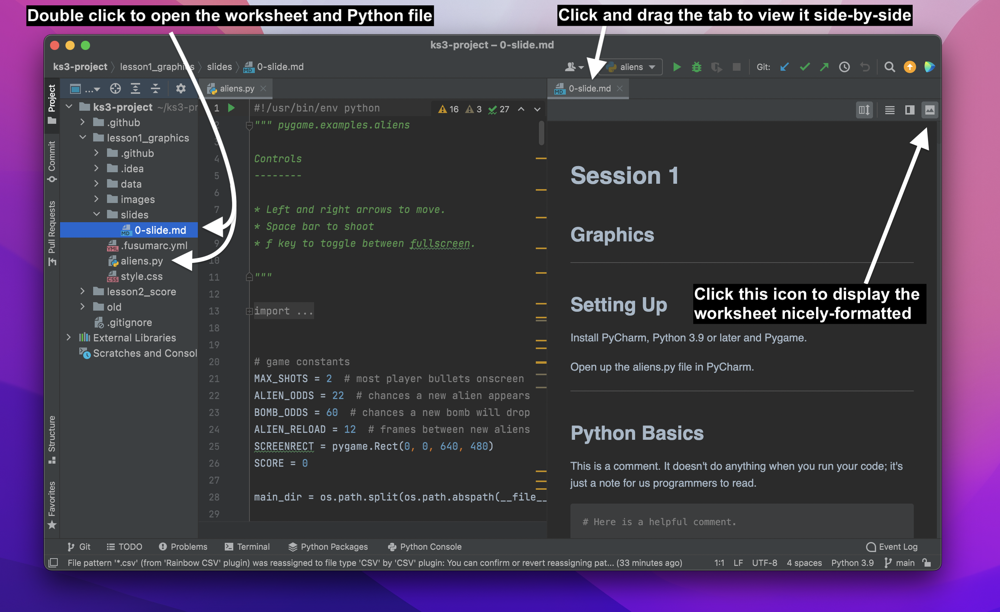

# KS3 Coding Project

## Prerequisites

PyCharm* - follow instructions to download the Community Edition here: https://www.jetbrains.com/pycharm/download/

Python - https://www.python.org/downloads/

pip - https://pip.pypa.io/en/stable/

PyGame - https://www.pygame.org/wiki/GettingStarted

\*
*Although other IDEs (Visual Studio, IDLE, etc.) would be equally suitable, these tutorials include some instructions on how to use the PyCharm IDE for beginners. If you're already comfortable editing and running Python scripts and can access the Python interpreter, feel free to stick with your favourite IDE.*

## Following the Worksheets

Either clone the repo or download it as a .ZIP file (click on the green button that says 'Code').

Each lesson has a folder which you should open with PyCharm. It contains the following:

* `slides/0-slide.md` (the worksheet to be followed)
* `aliens.py` (the starter code to be edited)
* `data/` (assets such as images and sounds to be used in the game)

In PyCharm you can double click on the .md worksheet and Python file to keep them open and drag the worksheet to the side so you can see both side-by-side.

