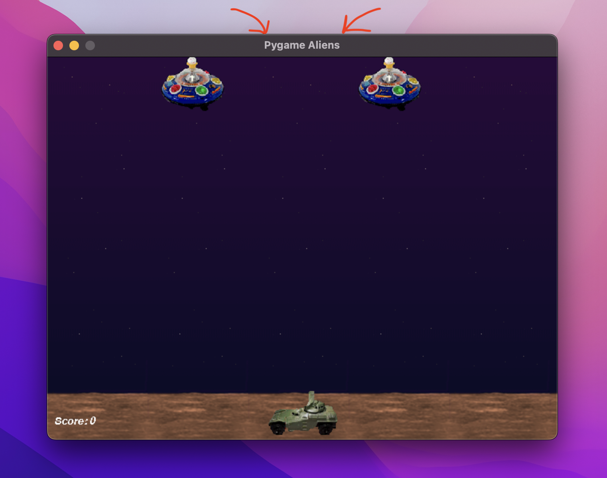
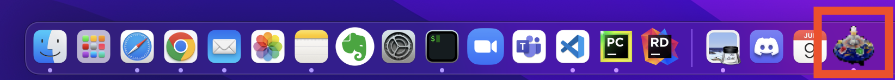

# Session 1

## Graphics


---

## Setting Up

*Insert information on installation and setup*


---

## The Window Title

First, find the comment that says *'decorate the game window'*. Beneath this you should see the following line of code:

```python
pygame.display.set_caption("Pygame Aliens")
```

This sets the **window title**.

### Your Turn

Replace `"Pygame Aliens"` with a title for your own game.




---

## The Window Icon

Now you should find the following code nearby:

```python
icon = pygame.image.load("data/alien1.gif")
icon = pygame.transform.scale(icon, (32, 32))
pygame.display.set_icon(icon)
```

1. The first line of code loads the image from the *alien1.gif* file in the *data* folder.
2. The second line scales the image to have a size of 32x32.
3. The final line sets the **window icon** for your game in the toolbar.



### Your Turn
At the moment, it loads the image from the *alien1.gif* file. Replace 'alien1.gif' with the filename of your own icon image.


---

## The Window Size

Right at the top of the file, you should see the *game constants*. These are values that always stay the same during the game (hence the name 'constant').

In particular, `SCREENRECT` is a constant value for the size of the screen.

```python
SCREENRECT = pg.Rect(0, 0, 640, 480)
```

The first two values must be `(0, 0)` for the top left corner. The second two values are the width (640) and the height (480).


---

## Your Turn

Try and change the size of the window to be:
* Small
* Large
* Wide but short
* Tall but narrow

Which is the easiest to play?


---

## Intro to Computer Graphics

So how do computer graphics work?

So far, we've introduced the display, which is the window that displays our game. A window is a rectangular area made up of pixels.


Each pixel is the smallest block of colour that can make up the image.

Originally, the window had a size of 640x480. That means it was 640 pixels wide and 480 pixels tall.


---

## Coordinates

In order to draw images onto the window, we need to know exactly where to place them. To do this, we use coordinates.

The top left pixel of the window is at coordinate (0, 0).


---

## Colours

Each pixel has one single colour. We use RGB values (red green blue) to express colours using numbers. 0 is the minimum and 255 is the maximum.

i.e. Colour(255, 0, 0) has maximum red but minimum green and blue.


---


## Sprites

The objects in a game are called **sprites**. A sprite can be anything including the player, other characters, collectable items, enemies and obstacles.


Each type of sprite has a class definition for it. Here is the class definition for *Player* sprites:

```python
class Player(pg.sprite.Sprite):
    ...
```

### Your Turn

Can you spot the sprite classes in the code?

How many sprites are there and what are they called?


---

## Sprite Classes

Although there's a lot of code in these sprite classes, there are only two things every sprite needs:

`self.image` and `self.rect`

The image is obviously the sprite's image that gets displayed on the screen.

The rect is the rectangular area it takes up on the screen.

<!--  -->


---

## Sprite Classes

```python
self.image = pygame.image.load("data/player1.gif")
self.rect = self.image.get_rect()
```

Here we load the image we want from a file and then set the rect to fit that image.

### Your Turn

Change the image of each sprite in the game. You can use your own images or download images from free-to-use websites like [itch.io](https://itch.io/game-assets/free/tag-2d).

Can you change the entire look and feel of the game by using different images?


---


