# Session 1

## Graphics


---

## Python Basics

This is a comment.
It doesn't do anything when you run your code; it's just a note for us programmers to read.

```python
# Here is a helpful comment.
```

Functions are commands that perform some kind of action.
They have a **name** and take in **parameters** (extra information). 

This is a `print` function. When it runs, its parameter (the `"Hello World!"` message) gets output to the console window.

```python
print("Hello World!")
```

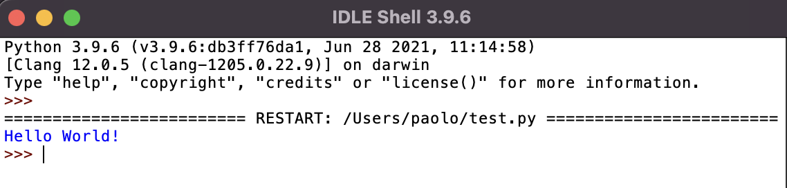

Some functions produce results.
We can save the result by storing it in a variable.

For example, the `round` function rounds a decimal number to the nearest whole number.
Here, we store the result in a variable called `x`.

```python
# This rounds 3.7 up to 4 and then stores 4 in x
x = round(3.7)
```


---

## Running Code

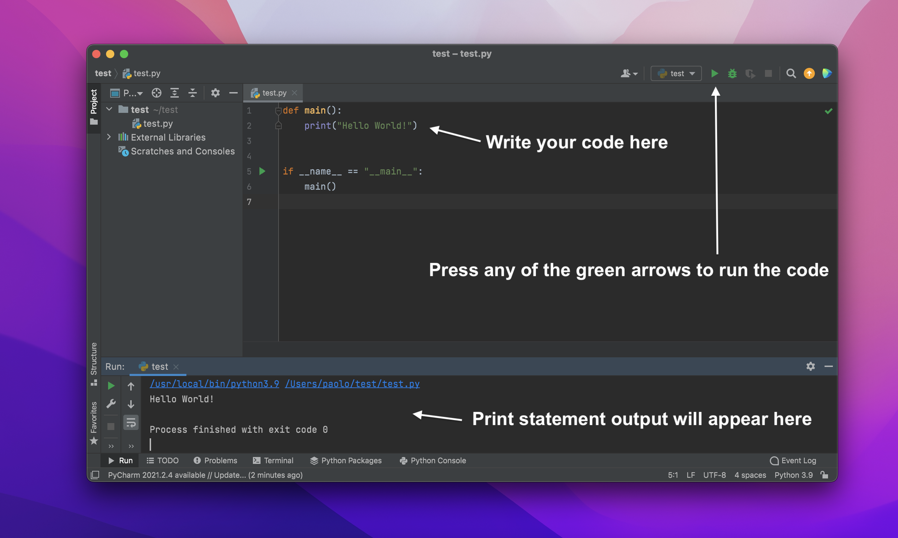

Order is important - when your code runs, it starts from the top of the file and carries out each instruction one after the other.

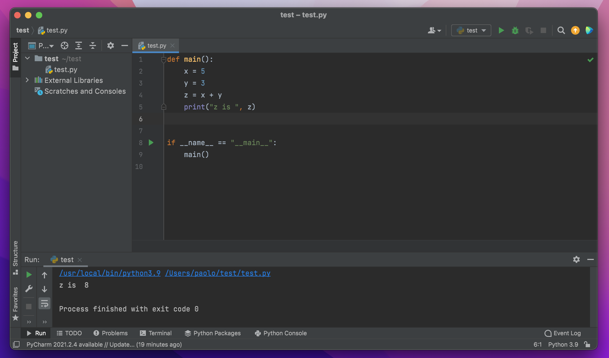


---

## Searching

Code files can get quite long pretty quickly. To search for something in your file, use `Cmd+F` (Mac) or `Ctrl+F` (Windows).

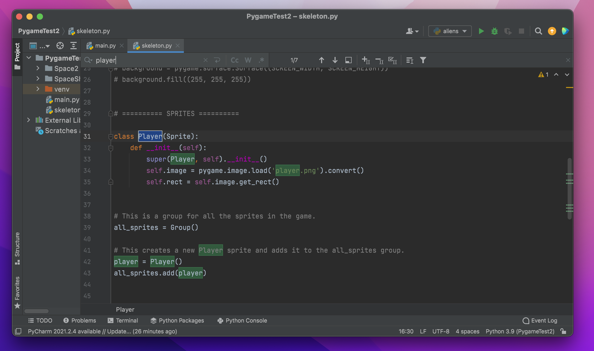

Also notice the **line numbers** to the left of your code. These can be handy when looking for a particular line of code in your file.


---

## Handling Errors

Sometimes things don't go the way we expect. If you see an error in the console window after running your code, don't panic. Here are some general tips to fix things:

1. The error message will often say which line of code failed. Find this line to try and locate the problem.
2. A **syntax error** is like a spelling mistake for code. Maybe you forgot a closing bracket `)`, a colon `:`, or a quotation mark `"`?

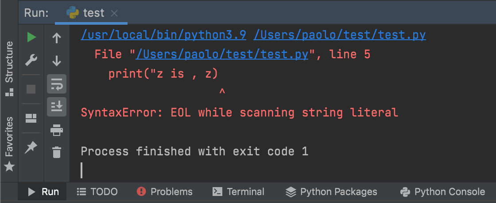

*Here I forgot to include a quotation mark at the end of my code. The error message says the problem is in line 5.*

3. If you're really stuck, try copying the error message into Google to search for solutions or ask for help!


---

# Example Game

Time to start making games!

We have an example game that ships with Pygame, called Aliens. Your player is a moon buggy at the bottom of the screen. The alien space ships descend from the top of the screen and drop bombs. If either a bomb or an alien hits you, you die.

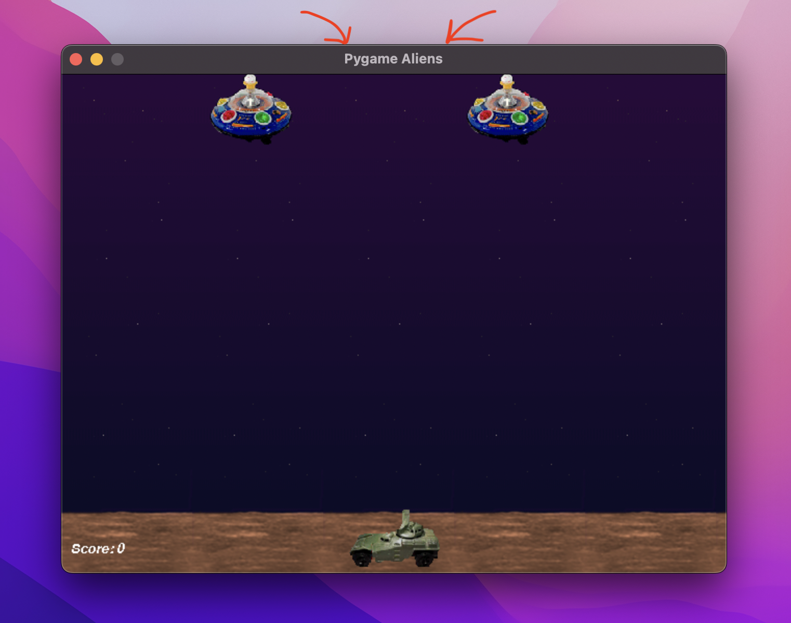

* Use the **arrow keys** to move around.
* Press the **spacebar** to fire at the aliens.
* Press the `ESC` key or **red button** to quit the game.


---

## The Window Title

First, find the comment that says *'decorate the game window'*.
Beneath this you should see the following line of code:

```python
pygame.display.set_caption("Pygame Aliens")
```

This is a function that sets the **window title**.

### Your Turn

Replace `"Pygame Aliens"` with a title for your own game.


Run the code to see the result!


---

## The Window Icon

Now you should find the following code nearby:

```python
icon = pygame.image.load("data/alien1.gif")
icon = pygame.transform.scale(icon, (32, 32))
pygame.display.set_icon(icon)
```

1. The first line of code loads the image from the *alien1.gif* file in the *data* folder.
2. The second line scales the image to have a size of 32x32.
3. The final line sets the **window icon** for your game in the toolbar.

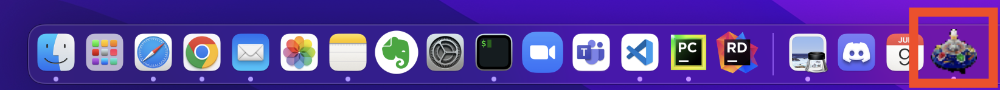


---

## Your Turn
At the moment, it loads the image from the *alien1.gif* file. Replace 'alien1.gif' with the filename of your own icon image.

Run the code to see if the icon changed.

### Common Errors

At this point you might get an error. Make sure that the image you're trying to use is in the `data` folder. In the code, your image name needs to include both the folder (`data/`) at the start and the file extension (e.g. `.png, .jpg, .gif`, etc.) at the end.

```python
"data/image_name.png"
```


---

## The Window Size

Right at the top of the file, you should see the *game constants*. These are values that always stay the same during the game (hence the name 'constant').

In particular, `SCREENRECT` is a constant value for the size of the screen.

```python
SCREENRECT = pg.Rect(0, 0, 640, 480)
```

The first two values must be `(0, 0)` for the top left corner. The second two values are the width (640) and the height (480).

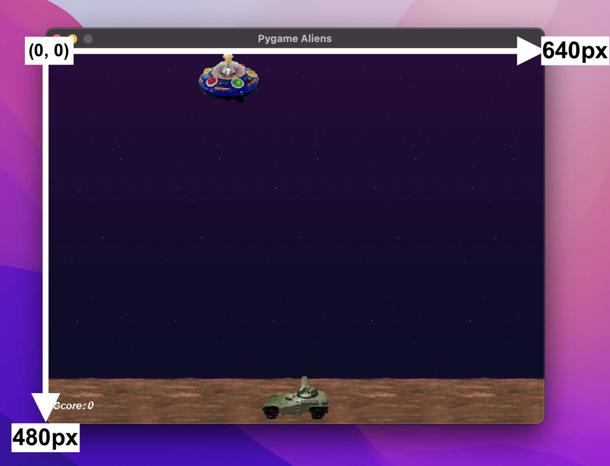


---

## Your Turn

Try and change the size of the window to be:
* Small
* Large
* Wide but short
* Tall but narrow

Which is the easiest to play?

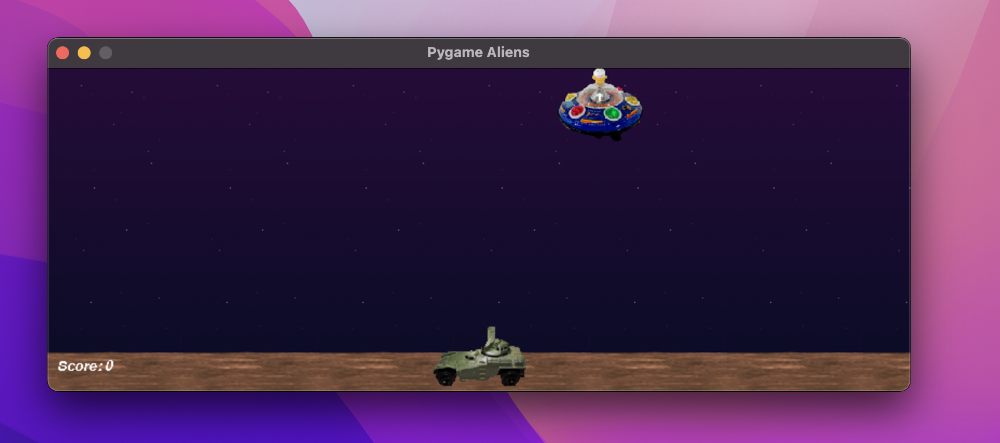


---

## Intro to Computer Graphics

So how do computer graphics work?

So far, we've introduced the display, which is the window that displays our game. A window is a rectangular area made up of pixels.

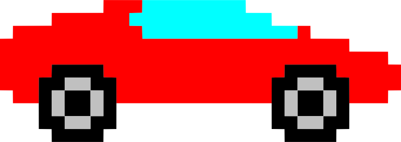

Each pixel is the smallest block of colour that can make up the image.

Originally, the window had a size of 640x480. That means it was 640 pixels wide and 480 pixels tall.


---

## Coordinates

In order to draw images onto the window, we need to know exactly where to place them. To do this, we use coordinates.

The top left pixel of the window is at coordinate (0, 0).


---

## Colours

Each pixel has one single colour. We use RGB values (red green blue) to express colours using numbers. 0 is the minimum and 255 is the maximum.

i.e. Colour(255, 0, 0) has maximum red but minimum green and blue.

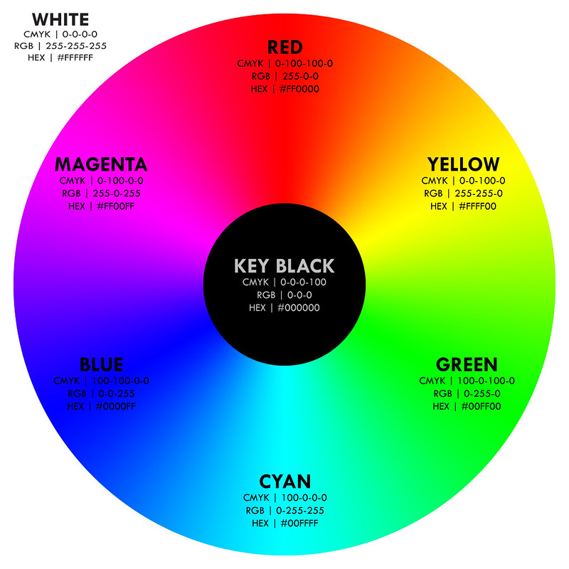


---


## Sprites

The objects in a game are called **sprites**. A sprite can be anything including the player, other characters, collectable items, enemies and obstacles.

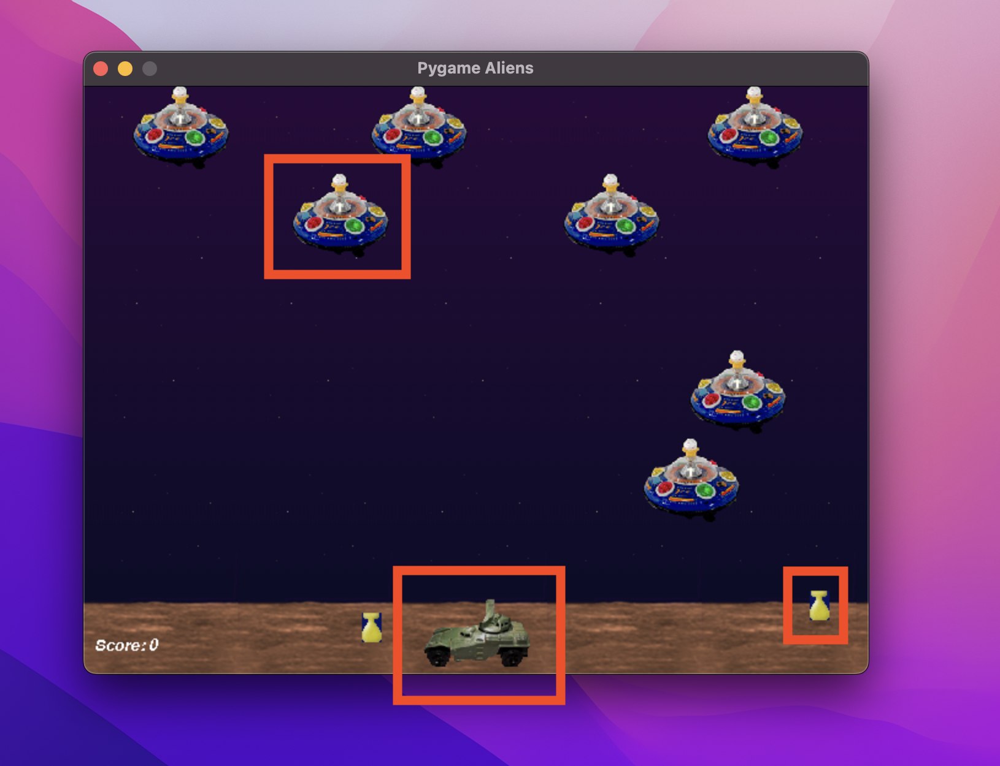

Each type of sprite has a class definition for it. Here is the class definition for *Player* sprites:

```python
class Player(pg.sprite.Sprite):
    ...
```

### Your Turn

Can you spot the sprite classes in the code?

How many sprites are there and what are they called?


---

## Sprite Classes (1)

A sprite class is like the blueprints for creating a sprite.
In it, we define what a sprite of that particular class should have and how it should behave.

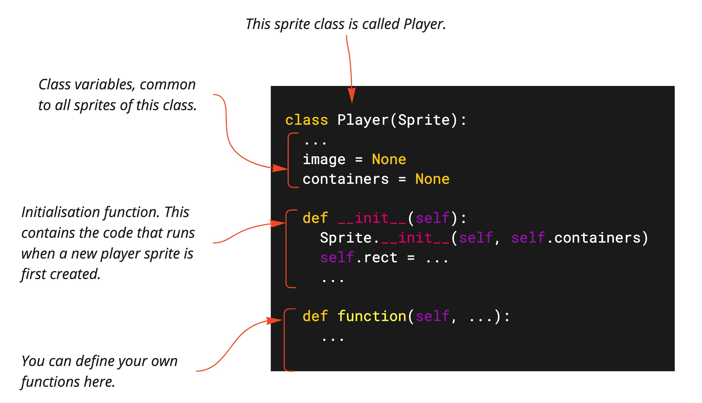


---

## Sprite Classes (2)

There are a few things that every sprite class needs:

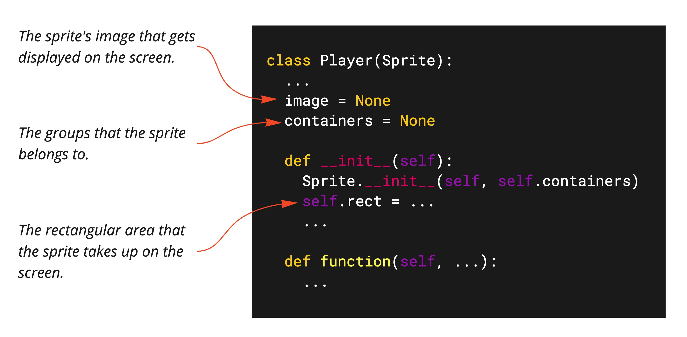

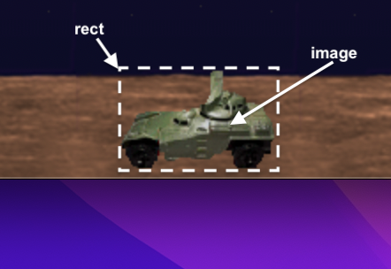


---

## Containers

`containers` is a class variable (common to all sprites of that class).
It stores the groups that the sprite belongs to.
We set this *outside* of the class.

Find the following code:

```python
# Assign default groups to each sprite class.
Player.containers = all
Alien.containers = aliens, all, lastalien
Shot.containers = shots, all
Bomb.containers = bombs, all
Explosion.containers = all
```

Don't worry too much about this now.
Just know that we use the `all` group to know what to render (display on the screen).
So if you define a new class of sprites, make sure to add `all` to its containers!


---

## Images

The sprite's image is also a class variable.
We set its value *outside* of the class.

Find the following code:

```python
# Assign default images to each sprite class.
Player.image = pygame.image.load("data/player1.gif")
Alien.image = pygame.image.load("data/alien1.gif")
Shot.image = pygame.image.load("data/shot.gif")
Bomb.image = pygame.image.load("data/bomb.gif")
```

Each line of code loads an image from the given filename and sets it as the image for a sprite class.

---

## Your Turn

Change the image of each sprite in the game.
You can use your own images or download images from free-to-use websites like [itch.io](https://itch.io/game-assets/free/tag-2d).

Make sure to save your images in the 'data' folder and include `"data/"` in the filename!

Can you change the entire look and feel of the game by using different images?

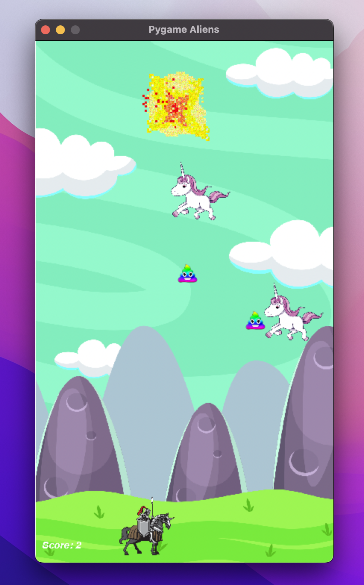


---

## Initialisation

So far, we've assigned an image to the sprite class and the groups its sprites should belong to.
Now we can define what should happen when we create a new individual sprite from this class.

Remember, this all happens inside the initialisation function:

```python
class Player(Sprite):
    ...

    def __init__(self):
        Sprite.__init__(self, self.containers)
        self.image = pygame.transform.scale(self.image, (90, 61))
        self.rect = self.image.get_rect()
        self.rect.midbottom = SCREENRECT.midbottom
        self.reloading = 0
        self.origtop = self.rect.top
        self.facing = -1
```


---

## How to Scale an Image

Inside the initialisation function, use the following function to scale an image.
Make sure to write it *before* setting `self.rect = ...`.
Replace `w` with the new width and `h` with the new height in pixels.

```python
self.image = pygame.transform.scale(self.image, (w, h))
```

### Your Turn

Can you make the player giant and the aliens tiny?

How about the other way round?

What happens when you scale the width more than the height?

---

## How to Remove Backgrounds

You can remove the background from your sprite's image by using the following function.
It takes in the RGB colour of the background as a parameter.

```python
self.image.set_colorkey((255, 0, 0))
```

This will make the red colour in the image transparent.


### Your Turn

If you haven't already, set the image for a sprite class to one that has a coloured background.

Now use the `set_colorkey` function to remove the background colour.


---

## Get Rect

This is the final essential thing we need to do!

After setting the image, we now need to set the `rect`.
Remember, this is the rectangular area that the sprite takes up on the screen.

There is one simple function we can use to do this.
Make sure it goes inside the initialisation (`__init__`) function *after* you're done setting up the image:

```python
self.rect = self.image.get_rect()
```


---

## Changing the Start Position

The previous function uses the dimensions of the image for the rectangle's area.
By default, it places the rectangle's top left corner at coordinate (0, 0).

If you then want to move the sprite to a different position, there are a bunch of options...

```python
self.rect.topleft = (100, 50) # This moves the sprite so its top left corner is at coordinate (100, 50).
self.rect.midright = (30, 200) # This moves the sprite so its mid right point is at coordinate (30, 200).
self.center = (100, 100) # This moves the sprite so its centre is at coordinate (100, 100).
```

You can get other points by combining top, bottom, mid, left and right (e.g. `midleft` or `bottomright`).

### Your Turn

Can you start the player off on the bottom left hand side of the screen?

Or the bottom right?


---

## Instantiating a Sprite

Great! You can now define a sprite class and everything a sprite needs in its initialisation function.

Now, to actually create an instance of this class and put it in the game, we do the following.

```python
Player()
```

Or

```python
player = Player()
```

If we want a reference to it for later.

Notice how the sprite class has an uppercase `P` but our specific instance is all lowercase.
(In fact, we could call the instance whatever we like, but `player` is most descriptive).

### Your Turn

Can you spot all the times we instantiate a sprite?

Are some sprites instantiated in multiple parts of the code?


---

## Challenges

Create a new sprite class for the game.
Maybe there should be a piece of cheese on the moon?
Or a planet in the background?

1. Give the class a name.
2. Add its `image` and `containers` class variables inside the class.
3. Set these values *outside* the class.
4. Create an initialisation (`__init__`) function.
5. Set the `rect`.
6. Optionally, you can resize, move and remove background colour.
7. Finally, create a new instance of the class.

