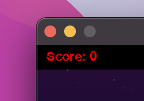
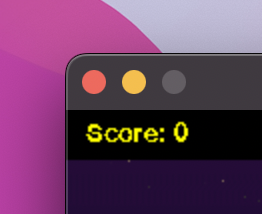
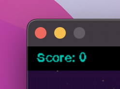
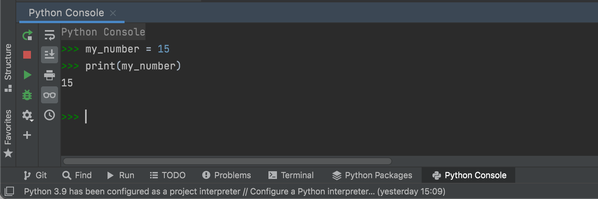
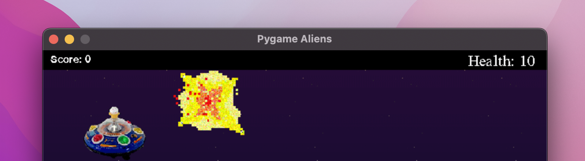
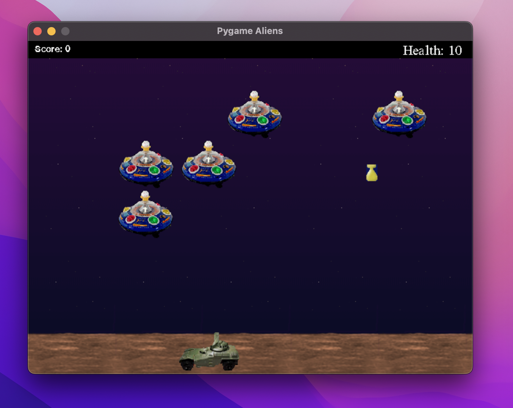

## Score and Stats


---

## Recap

Last time we looked at sprites. A sprite is an object in the game (like an alien or a bomb).

Each sprite has an image and a rect.

`self.image` and `self.rect`


Today we're going to investigate a particular type of sprite: text.


---

## Font

First, find the **Score** sprite class. This is an object in the game that is used to display the score.

Notice how it has a **font**:

```python
self.font = pygame.font.SysFont(None, 20, bold=False, italic=False)
```

It takes in 4 parameters:

* The type of font (None is the default),
* The font size (20 pixels tall),
* Whether or not it is bold (no), and
* Whether or not it is italic (no).


---

## Your Turn

Change the font size and set bold and italic to True.

Although `None` gives us the default font style, we can choose a different style if we like.

Check the next slide to find out which fonts are available to you.

Try a few of them out by replacing `None` with the font name. Remember to use quotation marks!

```python
self.font = pygame.font.SysFont("times", 20, bold=False, italic=False)
```

Run the code to see the difference.


---

## Which Fonts Can I Use?

1. Open up the Python Console window.


2. Import the Pygame module.

```python
>>> import pygame
```

3. Check which fonts are available to use.

```python
>>> pygame.font.get_fonts()
```

This should display a list of all the font names you can use.


---

## Rendering Font

The following line of code sets the image of the **Score** sprite.

```python
self.make_images = self.font.render(self.message, False, WHITE)
```

It uses the font we just created to render the message. Here, our message is stored in `self.message`.

### Your Turn

`WHITE` is a constant defined at the top of the file. Can you change the colour of the score text by defining and using new constant colours?







<details>
    <summary>Hint</summary>
Under the 'colour constants' comment, write

```python
RED = pygame.colour.Colour(255, 0, 0)
```

Then, back in the Score sprite, change WHITE to RED:

```python
self.make_images = self.font.render(self.message, False, RED)
```

Now try the same for yellow and teal (use the colour wheel from worksheet 1 to help).
</details>

---

## Updating the Score

At the moment, the score is always 0. It's time we change that. But before we do, we're going to need to know how to use **variables**.


---

## Variables

What is a variable? Just like in maths, a variable has a label (like x) and stores a value (like the number 7).

```python
x = 7
```

We can give variables any name we like, as long as they start with a letter and only contain letters, numbers and the underscore `_`.

```python
my_variable = 519
```

### Your Turn

In the **Python Console** window, create a new variable, store a value in it and then use the `print()` command to see its contents.



---

## Mathematical Operations

In code, we can do all the normal mathematical operations and store the results in variables.

```python
x = 5 + 7 # addition

x = x - 5 # subtraction

var = x * 2 # multiplication

result = x / var # division

result = (2 + x) / 10 # order of operations
```

### Your Turn

1. Create a variable called *'radius'* and give it a value.
2. Using *radius*, calculate the perimeter of the circle and store it in a new variable called *'perimeter'*.
3. Print the result to see if it worked.

<details>
    <summary>Hint</summary>
The formula for calculating the perimeter of a circle is:

`perimeter = 2πr`

where `r` is the radius and `π` is pi (approximately 3.14).
</details>

---

## Data Types

There are different types of data we can use in Python. For example...

```python
age = 10 # int (integer)

bank_balance = 1.97 # float (decimal)

is_funny = True # bool (True or False)

password = "Robert2022!" # str (string of characters)
```

### Your Turn

What happens when you add...
* two integers together?
* two strings together?
* an integer and a string?


---

## Type Casting

We can use **type casting** to convert from one data type to another.

```python
x = int("7") # stores the int 7 in x
y = str(7) # stores the string "7" in y
z = float(7) # stores the float 7.0 in z
```

### Your Turn

1. Convert the string `"7.5"` to a float
2. Add it to the float `2.5`
3. Convert the result to an integer
4. Print the result - you should get `10`


---

## Back to Score

Time to update the score! Notice how there are two function definitions inside the Score sprite class:

`__init__()` and `increment_score()`

```python
class Score(Sprite):
    def __init__(self):
        ...
    
    def increment_score(self):
        ...
```

* The `__init__` function is called when the score is first initialised.
* The `increment_score` function is one I defined earlier. It doesn't do anything at the moment, but it gets called every time a bullet hits an alien.


---

## Initialisation

All setup instructions should take place under the `__init__()` function. So let's create a variable to store the score there. Notice how variables inside sprite classes often start with '`self.`':

```python
self.variable_name = value
```

### Your Turn

Create a new variable called **score** and let it store **0** as its initial value.


---

## Incrementing the Score Variable

Since we want the score to increase each time we hit an alien, this code should go under the `increment_score()` function.

### Your Turn

Can you add 1 to the score and store the result back in your score variable?


---

## Updating the Score Text

After updating the score, we now need to change the message that we want to display.

The problem is that our message is a **string** but our score is an **int**.

### Your Turn

1. Convert your score to a string,
2. Add it onto the end of the string `"Score: "`, and then
3. Save the result in the `self.message` variable.

Finally, use this line of code to update our score image with the new message:

```python
self.make_images = self.font.render(self.message, False, WHITE)
```

Run the game and check if the score updates properly each time you shoot an alien.

<details>
    <summary>Stuck?</summary>

```python
class Score(Sprite):
    def __init__(self):
        Sprite.__init__(self, self.containers)
        self.font = pygame.font.SysFont(None, 20, bold=False, italic=False)
        self.message = "Score: 0"
        self.image = self.font.render(self.message, False, WHITE)
        self.rect = self.image.get_rect()
        self.rect.move_ip(10, 5)
        self.score = 0

    def increment_score(self):
        self.score = self.score + 1
        self.message = "Score: " + str(self.score)
        self.image = self.font.render(self.message, False, WHITE)
```
</details>

---

## Health

Let's make a new stat for health. Instead of dying immediately, we could start the player off with a set amount of health or lives. Each time they get hit, they lose health. When it reaches 0, they die.




---

## Defining a New Sprite

First off, we're going to need to create a new sprite to store the health. If you need help, use the **Score** sprite for inspiration. Don't expect anything to happen straight away, this will come on the next page...

### Your Turn

1. Make a new sprite class called **Health**.
2. Set a `containers` class variable to store `None`.
3. Create an `__init__()` function.
4. Inside this function, create the following:
* The font you want to use,
* The initial message (`"Health: 10"`),
* The sprite's image (the message rendered using the font),
* The rect from the image.
5. Finally, move the rect in place using the `move_ip()` function.


---

## Setting the Sprite Group

Now it's time to set which group(s) our sprite class should be a member of.
In this case, our Health sprite is supposed to be part of the heads up display (HUD), so we need to add it to the `hud` group.

Search for the following code:

```python
# Assign default groups to each sprite class.
Player.containers = all
Alien.containers = aliens, all, lastalien
...
```

Add the following line of code here to set `hud` as the default group for `Health` sprites:

```python
Health.containers = hud
```


---

## Creating the Sprite

So far, we've defined the *class* of the sprite, i.e. what a Health sprite 'should' have.
Now we need to create an actual instance of this sprite.

Search for the following code:

```python
# Initislize our starting sprites.
player = Player()
Alien()
...
```

Create an instance of the health sprite by adding this line here:

```python
health = Health()
```


---

## Testing

Now if you run the game, you should see your health sprite displayed. You might need to tweak your initial values under the `__init__()` function.



<details>
    <summary>Stuck?</summary>

```python
class Health(Sprite):
    containers = None
    
    def __init__(self):
        Sprite.__init__(self, containers)
        self.font = pygame.font.SysFont('times', 20, bold=False, italic=False)
        self.message = "Health: 10"
        self.image = self.font.render(self.message, False, WHITE)
        self.rect = self.image.get_rect()
        self.rect.move_ip(SCREENRECT.width - 80, 5)
```
</details>

---

## Updating Health

To update the health, we're going to need to add a `lives` variable to store the number of lives left and a new function under the Health sprite class.

```python
class Health(Sprite):
    ...
    
    def __init__(self):
        Sprite.__init__(self, containers)
        ...
        self.lives = 10
        ...
    
    def reduce_health(self):
        ...
```

### Your Turn

1. Initialise the `lives` variable under the `__init__()` function.
1. Create a new function called `reduce_health()`.
2. Just like we did with score, add code under the `reduce_health()` function that reduces the `lives` value, updates the message and renders the image.

<details>
    <summary>Stuck?</summary>

```python
class Health(Sprite):
    containers = None

    def __init__(self):
        Sprite.__init__(self, self.containers)
        self.font = pygame.font.SysFont('times', 20, bold=False, italic=False)
        self.message = "Health: 10"
        self.image = self.font.render(self.message, False, WHITE)
        self.rect = self.image.get_rect()
        self.rect.move_ip(SCREENRECT.width - 80, 5)
        self.lives = 10

    def reduce_health(self):
        self.lives = self.lives - 1
        self.message = "Health: " + str(self.lives)
        self.image = self.font.render(self.message, False, WHITE)
```
</details>

---

## Calling the Function

Now that we've defined the function, we need to call it each time the player gets hit by an alien or bomb.

### Your Turn

1. Search for each time we call `player.kill()`.
2. Replace `player.kill()` with `health.reduce_health()`.

<details>
    <summary>Hint</summary>

You should find `player.kill()` twice, once under each of the following comments:

`# Detect collisions between aliens and players.`

and

`# See if alien bombs hit the player.`
</details>


---

## Dying

If you run the game now, you should see that health gets reduced each time you get hit by an alien or bomb.

<details>
    <summary>Not working?</summary>
Make sure you followed the previous steps exactly and your `Health` class looks like this:

```python
class Health(Sprite):
    containers = None
    
    def __init__(self):
        Sprite.__init__(self, self.containers)
        self.font = pygame.font.SysFont("times", 18, bold=False, italic=False)
        self.message = "Health: 10"
        self.image = self.font.render(self.message, False, WHITE)
        self.rect = self.image.get_rect()
        self.rect.move_ip(SCREENRECT.width - 80, 5)
        self.health = 10

    def reduce_health(self):
        self.health = self.health - 1
        self.message = "Health: " + str(self.health)
        self.image = self.font.render(self.message, False, WHITE)
```
</details>

But now you're immortal...

### Your Turn

To fix this, do the following:

1. Search for the following code:

```python
# Draw the scene.
all.draw(screen)
hud.draw(screen)
pygame.display.update()
```

Just *before* this, add these two lines of code to kill the player if health reaches 0.

```python
if health.health == 0:
    player.kill()
```

Now if you run the game, health should reduce each time you get hit, and when it reaches 0, you die!


---

## Challenges

1. Change the value of hitting aliens. Instead of increasing score by 1 each time, add 5 or double it.
2. Make health a `float`. Start from `10.0` and each time you get hit, reduce it by `0.5`.
3. Randomise score. Maybe some aliens are more important than others and give a higher score? Check out [Python's random module](https://www.tutorialsteacher.com/python/random-module) to see how to generate random numbers in Python.
4. Change it so that getting hit by a bomb reduces your health by `0.5` but getting hit by an alien reduces your health by `2.0`.
5. Add another stat to the heads up display (HUD). Maybe the player's username? Or the elapsed time? (Check out [Pygame's get_ticks() function](https://www.pygame.org/docs/ref/time.html))
