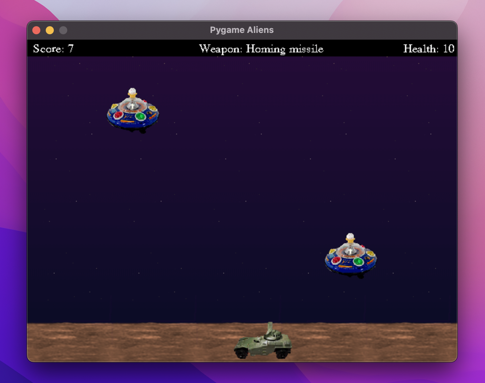
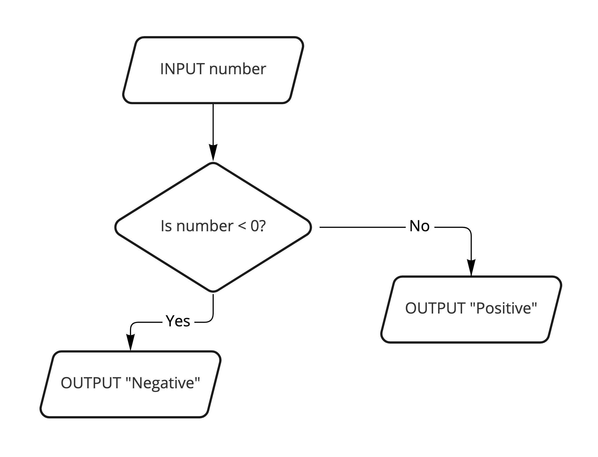
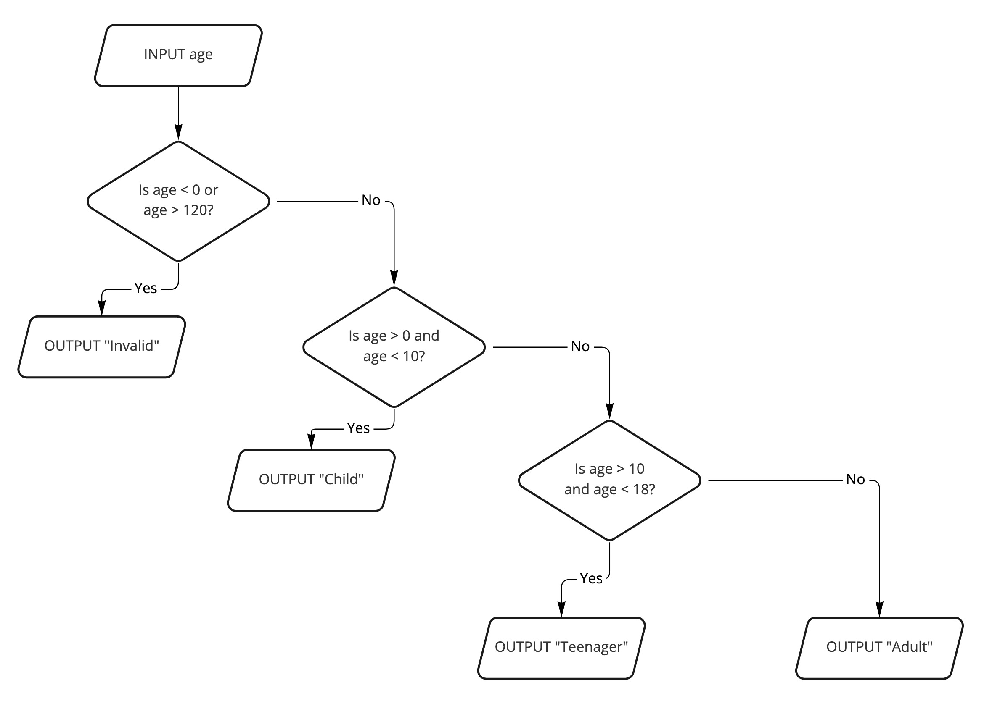
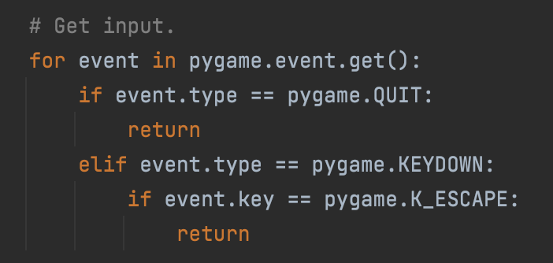

# Session 3

## Input


---

## The Objective

In this session, we're going to learn how to handle user input and select between different options depending on what the user did.

We'll give the user the ability to choose different types of weapons during the game.



First, we need to learn about selection.


---

## Selection

Often in programming we want to choose, or select, between different options and do different things depending on the decision.



```python
number = int(input("Enter a number: "))
if number < 0:
    print("Negative") # This line is 'inside' the if statement
else:
    print("Positive")
```

Notice how the code inside the `if` statement only gets run if the condition is true.
Otherwise, it moves on to the code below it.

The `else` statement is used to handle what should happen if the condition is not true.


---

## IF Statement

You don't always need an `else` statement, an `if` statement by itself is perfectly fine:

```python
number = int(input("Enter a number: "))
if number == 0:
    print("Zero")
print("Thanks!")
```

### Your turn

Write the above code in your Python Console and see what happens when you enter 0 or any other number.


---

## Conditions

An if statement checks to see if a condition is true.
If so, it runs the code inside it.

We can build conditions using the following operators:

* `<` (less than)
* `>` (greater than)
* `<=` (less than or equal to)
* `>=` (greater than or equal to)
* `==` (equal to)
* `!=` (not equal to)
* `and`
* `or`
* `not`

For example:

```python
age = int(input("Enter your age: "))
if age > 0 and age < 10:
    print("Child")
```

### Your Turn

Can you write if statements to check if someone is a teenager based on their age?
What about an adult?


<details>
    <summary>Stuck?</summary>

```python
age = int(input("Enter your age: "))
if age > 10 and age < 18:
    print("Teenager")
if age >= 18:
    print("Adult")
```
</details>


---

## Nesting

Sometimes we might have a tree of possibilities.



'Nesting' is where we have an if statement inside another if/else statement.

```python
age = int(input("Enter your age: "))
if age < 0 or age > 120:
    print("Invalid")
else:
    if age > 0 and age < 10:
        print("Child")
    else:
        if age > 10 and age < 18:
            print("Teenager")
        else:
            print("Adult")
```


---

## ELIF

In certain cases (like the previous one) we can simplify things by using `elif`.
This is short for `else if`.

i.e.

```python
...
else:
    if <condition>:
        ...
```

can be shortened to

```python
...
elif <condition>:
    ...
```

### Your Turn

Can you rewrite the code in the previous example using `elif`?

<details>
    <summary>Stuck?</summary>

```python
age = int(input("Enter your age: "))
if age < 0 or age > 120:
    print("Invalid")
elif age > 0 and age < 10:
    print("Child")
elif age > 10 and age < 18:
    print("Teenager")
else:
    print("Adult")
```
</details>


---

## Events

In Pygame, events can occur throughout the game.
These include key presses and mouse movement.
We can use IF statements to check the type of event that has occurred. 

Search for the following code to see this in action:

```python
# Get input.
for event in pygame.event.get():
    if event.type == pygame.QUIT:
        return
    elif event.type == pygame.KEYDOWN:
        if event.key == pygame.K_ESCAPE:
            return
```

Once we know that the type of event is a `KEYDOWN` event, 
we can then use a nested if statement to check which key was pressed.


---

## Your Turn

Here are some examples of key codes:

* `pygame.K_ESCAPE` (the escape key)
* `pygame.K_a` (the letter 'a' key)
* `pygame.K_m` (the letter 'm' key)
* `pygame.K_0` (the number '0' key)
* `pygame.K_5` (the number '5' key)

Can you add some `elif` statements to check for different key presses?

Inside each if statement, use `print()` to output which key was pressed.

Now if you run the game and press those keys, you should see the correct output in the console window.

<details>
    <summary>Hint</summary>

Here's an example of an `elif` statement being used.
Can you add your own?
```python
# Get input.
for event in pygame.event.get():
    if event.type == pygame.QUIT:
        return
    elif event.type == pygame.KEYDOWN:
        if event.key == pygame.K_ESCAPE:
            return
        elif event.key == pygame.K_a:
            print("The 'a' key was pressed.")
```
</details>


---

## Selecting a Weapon

Great! Now let's use key presses to select a different weapon.

The `weapon_type` variable is a `WeaponType` sprite, which displays text showing the chosen weapon.


At the moment it always displays `Weapon: Default`.

### Your Turn

Search for the `WeaponType` sprite class. Can you see what function it has for updating its text?


---

## Your Turn

1. Go back to the event-checking code:



2. Add some `elif` statements to check if the user pressed the `1`, `2` or `3` number keys.

3. Inside these statements, change the weapon type text using the following code:

```python
weapon_type.set_weapon("Default")
```

Choose a different name for each type of weapon (1, 2 and 3).
Make sure that one of them is "Default".

4. Run the game and press the buttons 1, 2 and 3 to confirm that the correct choice of weapon is displayed.

<details>
    <summary>Stuck?</summary>

```python
# Get input.
for event in pygame.event.get():
    if event.type == pygame.QUIT:
        return
    elif event.type == pygame.KEYDOWN:
        if event.key == pygame.K_ESCAPE:
            return
        elif event.key == 0:
            weapon_type.set_weapon("Default")
        elif event.key == 1:
            weapon_type.set_weapon("Homing Missiles")
        elif event.key == 2:
            weapon_type.set_weapon("Rapid Fire")
```
</details>


---

## Homing Missiles

Let's add a new type of weapon to the game: homing missiles.

Search for the `HomingMissile` sprite class.
It's very similar to the `Shot` sprite class, which is the default.

The `update()` function gets triggered every frame of the game (30 times per second).
It sets the amount to move in the horizontal and vertical directions:

```python
horizontal = 0
vertical = -5
```

It then uses the `move_ip()` function to move the missile's rect vertically up 5 pixels:

```python
self.rect.move_ip(horizontal, vertical)
```

It also checks to see if it reached the top of the screen.
If so, it removes the sprite from the game:

```python
if self.rect.top <= 0:
    self.kill()
```


---

## Your Turn

Since this is a homing missile, we want to be able to control it as it flies.

1. Find the comment that says `TODO: control missile here.`. This is where you should write the following code.

2. Add the following line:

```python
keystate = pygame.key.get_pressed()
```

`keystate` now contains a set of the keys that are currently being pressed by the user.

We can check for specific keys (such as the number '0') like this:

```python
if keystate[pygame.K_0]:
    ...
```

3. Add if statements to check if each of the WASD keys are being pressed down.

4. For each key, change the value of the `horizontal` and `vertical` variables accordingly.

* 'A' keypress —> set horizontal to -5 
* 'D' keypress —> set horizontal to 5
* 'W' keypress —> set vertical to -5
* 'S' keypress —> set vertical to 5

<details>
    <summary>Stuck?</summary>

```python
def update(self):
    horizontal = 0
    vertical = -5
    keystate = pygame.key.get_pressed()
    if keystate[pygame.K_a]:
        horizontal = -5
    elif keystate[pygame.K_d]:
        horizontal = 5
    elif keystate[pygame.K_w]:
        horizontal = -5
    elif keystate[pygame.K_s]:
        horizontal = 5
    self.rect.move_ip(horizontal, vertical)
    if self.rect.top <= 0:
        self.kill()
```
</details>

---

## Switching Between Weapons

Now that we've defined how a `HomingMissile` sprite should behave, we can add them to the game.

### Your Turn

1. Search for the following code:

```python
# Handle player input.
direction = keystate[pygame.K_RIGHT] - keystate[pygame.K_LEFT]
player.move(direction)
firing = keystate[pygame.K_SPACE]
if not player.reloading and firing and len(shots) < MAX_SHOTS:
    Shot(player.gunpos())
    if pygame.mixer:
        shoot_sound.play()
player.reloading = firing
```

At the moment, if the conditions are met, we create a new `Shot` sprite when the user fires their weapon.

```python
Shot(player.gunpos())
```

2. Can you change this code so that it only creates a `Shot` if `weapon_type.weapon` is set to "Default"?

3. Next, write an else statement to create a `HomingMissile` sprite instead if a different weapon type is chosen.

4. Now if you run your code, you should be able to press the '1' key to switch to homing missiles.
Once this weapon type is selected you'll be able to control it using the WASD keys.

<details>
    <summary>Stuck?</summary>

```python
if not player.reloading and firing and len(shots) < MAX_SHOTS:
    if weapon_type.weapon == "Default":
        Shot(player.gunpos())
    else:
        HomingMissile(player.gunpos())
```
</details>


---

## Rapid Fire

Here's some code that will create 3 standard shots, spaced apart from each other.

```python
x, y = player.gunpos()
Shot((x, y))
Shot((x, y - 30))
Shot((x, y - 60))
```

### Your Turn

Can you add an elif statement that checks for a different weapon type and then runs the above code if it's selected?

<details>
    <summary>Stuck?</summary>

```python
if not player.reloading and firing and len(shots) < MAX_SHOTS:
    if weapon_type.weapon == "Default":
        Shot(player.gunpos())
    elif weapon_type.weapon == "Rapid Fire":
        x, y = player.gunpos()
        Shot((x, y))
        Shot(x, y - 30)
        Shot((x, y - 60))
    else:
        HomingMissile(player.gunpos())
```
</details>


---

## Extra Challenges

1. If the user presses the '0' key, the image for their vehicle changes.
2. Add a feature that lets the user press buttons to change the speed of their vehicle (both increase and decrease).
3. Add a new type of weapon that allows the user to click on aliens with their mouse to kill them.
