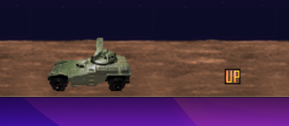

# Session 4

## Collisions


---

## Importance of Collisions

A collision is where the rects of two sprites intersect.

This is very important in games where we may need to check if...

* the player is touching an obstacle,
* a projectile hits its target,
* the player collides with a collectible pickup,
* etc.

Today we're going to add collectible power-ups to the game.




---

## Power Up Sprite

Search for the following code.
This is a new sprite class for powerup sprites.

```python
class PowerUp(Sprite):
    def __init__(self):
        Sprite.__init__(self, self.containers)
        self.image = pygame.make_images.load("data/powerup.png")
        self.image = pygame.transform.scale(self.image, (16, 16))
        self.rect = self.image.get_rect()
        x = random.randrange(30, SCREENRECT.width - 30, 30)
        self.rect.move_ip(x, SCREENRECT.height - 50)
        self.y_offset = 0.0

    def update(self):
        y = int(math.sin(self.y_offset) * 3)
        self.rect.move_ip(0, y)
        self.y_offset += 0.2
```

In the initialisation function, it sets the image and randomly chooses its starting position.

The update function (which gets triggered every frame) moves the collectible up and down.


---

## Sprite Groups

A sprite group is a set of related sprites.
Here we've made a group for all the aliens in the game, all the heads-up display (HUD) text, etc.
The `all` group is used to contain every sprite in the game, so we can render them.

```python
# Initialize Game Groups.
aliens = Group()
shots = Group()
bombs = Group()
all = RenderUpdates()
hud = Group()
lastalien = GroupSingle()
```

### Your Turn

Can you create a new group for powerups?

<details>
    <summary>Hint</summary>

Create a new variable called `powerups` and assign it a new `Group()`.
</details>


---

## Adding Sprites to Groups

We can specify which groups a sprite should belong to by setting their containers:

```python
# Assign default groups to each sprite class.
Player.containers = all
Alien.containers = aliens, all, lastalien
Shot.containers = shots, all
...
```

### Your Turn

Can you set the power up sprite to belong to both the `all` group as well as the new one you just created?

<details>
    <summary>Hint</summary>

Check out the code above.
See how we set the `Shot` sprite class to belong to the `shots` and `all` groups by default?
To do the same for power ups, copy that line and replace `Shot` with `PowerUp` and `shots` with the name of your new group.
</details>


---

## Removing Sprites from Groups

To remove a sprite from the game we use the following command:

```python
<sprite>.kill()
```

This automatically removes it from any groups it was in.

### Your Turn

Find each instance where we trigger the `kill()` function.


---

## Collision Detection

There are a few ways we can detect collisions in Pygame.
If you search through the code, you'll notice a few different approaches.

The first is `groupcollide(group1, group2)`, which checks if any sprite from group2 collided with a sprite from group1.

The second is `spritecollide(sprite, group)`, which checks if the given sprite collided with a member of the given group.


---

## Group Collide

You can search for the following code.
It detects collisions between the player's shots and aliens.

```python
for alien in groupcollide(shots, aliens, dokill=True, dokill2=True).keys():
    ...
    Explosion(alien)
    ...
```

The `groupcollide()` function checks for collisions between the sprites in two groups.

It takes in two groups as parameters (in this case `shots` and `aliens`).

`dokill` is set to `True` for both groups so that when a collision is detected between a shot and an alien, both will be removed from the game.

The function will detect any collisions between the groups, and we can then use a `for` loop to iterate over each sprite (`alien`) that got hit from the second group.

Be aware that we need to include `.keys()` at the end.
This goes beyond the scope of these worksheets, but if you're interested, look up [Python dictionaries](https://www.programiz.com/python-programming/dictionary).


---

## Sprite Collide

The `spritecollide()` function is used to check for collisions between one specific sprite and all the sprites in a certain group.

```python
for bomb in spritecollide(player, bombs, dokill=True):
    ...
    Explosion(bomb)
    ...
```

In this case, the first parameter is the single sprite (`player`) and the second is the group (`bombs`).

Just as before, we set `dokill` to `True` if we want the sprite bomb that the player collided with to be removed from the game on collision.

We also use a `for` loop to iterate over each `bomb` that was detected to have collided with the `player` sprite.


---

## Your Turn

*Hint: Check out the code when the bomb hits the player for inspiration.*

1. Use the `spritecollide()` function to check if the player collided with a member of your powerup group.
2. Make sure that `dokill` is set to `True` so the powerup is removed from the game.
3. Trigger the new `increase_health()` function on the `health` sprite to add to the player's health.

<details>
    <summary>Stuck?</summary>

```python
for powerup in spritecollide(player, powerups, dokill=True):
    health.increase_health()
```
</details>

---

## Creating Powerups

### Your Turn

Search for the following code:

```python
# Create new alien.
if alienreload:
    alienreload = alienreload - 1
elif not int(random.random() * ALIEN_ODDS):
    Alien()
    alienreload = ALIEN_RELOAD
```

This code creates a new alien randomly at regular intervals.
Try to use a similar approach to create new powerups.

We've already defined the following variables/constants to help you:

* `powerup_reload`
* `POWERUP_ODDS`
* `POWERUP_RELOAD`

Once done, you should be able to run the game and see collectible powerups appear!

<details>
    <summary>Stuck?</summary>

```python
# Create new powerup.
if powerup_reload:
    powerup_reload = powerup_reload - 1
elif not int(random.random() * POWERUP_ODDS):
    PowerUp()
    powerup_reload = POWERUP_RELOAD
```
</details>


---

## Loops

By now, you will have seen a lot of loops.
A loop is used to repeat the same section of code multiple times. For example...

A `while` loop repeats while the condition is true.
In this case, we repeat the code inside the loop as long as the player is alive:

```python
# Run our main loop whilst the player is alive.
    while player.alive():
```

A `for` loop repeats for a set number of times.
In this case, we repeat the code inside the loop for each event that has been triggered:

```python
# Get input.
    for event in pygame.event.get():
```

### Your Turn

Can you find other examples of `for` and `while` loops in the code?


---

### WHILE Loops

A WHILE loop is very similar to an IF statement.
It checks if a *condition* is true and if so, repeats the *code* inside the loop.

```python
while <condition>:
    <code>
```

Beware! A common pitfall with while loops is that if the condition stays true, the loop will repeat infinitely.
It's important to make sure your condition is possible to be reached.
If you find your code freezes because it's stuck in an infinite loop, you can always press `Ctrl+C` to force it to stop.


---

## Your Turn

Using the Python Console...
1. Ask the user to enter a password.
2. While the password is not equal to "password123",
3. Ask them to retry.
4. Once they enter the correct password, output "correct!".

<details>
    <summary>Answer</summary>

```python
password = input("Please enter a password: ")
while password != "password123":
    password = input("Please retry: ")
print("Correct!")
```
</details>


---

## FOR Loops

We use WHILE loops when we're not sure how many times we'll have to repeat for.
If you do know exactly how many iterations you need, you can use a FOR loop instead.

So far, we've seen FOR loops used a lot to iterate over the items in a group.
A more common use you'll have is to repeat a block of code an exact number of times:

```python
for i in range(0, 10):
    print(i)
```

This repeats 10 times.
The variable `i` starts off at 0 and each time it repeats, its value increases by 1.


---

## Your Turn

Using the Python Console...
1. Ask the user to input a number between 1 and 12.
2. Use a for loop to output the times table for that number.

e.g. if the user enters 5, the output should be:

```python
5
10
15
20
25
30
35
40
45
50
55
60
```

<details>
    <summary>Answer</summary>

```python
number = int(input("Please enter a number between 1 and 12: "))
for i in range(1, 13):
    print(number * i)
```
</details>

---

## Challenges

1. Add another type of collectible powerup to the game. Once collected, it should increase the player's speed.
2. Add a new type of weapon that creates a random number of shots at once. *Hint: check out the rapid fire code, [Python's random module](https://www.w3schools.com/python/module_random.asp) and make sure to use a for loop!*
3. Add another type of alien that drops vertically down from the sky instead of zig-zagging. It should kill anything it touches (including other aliens).