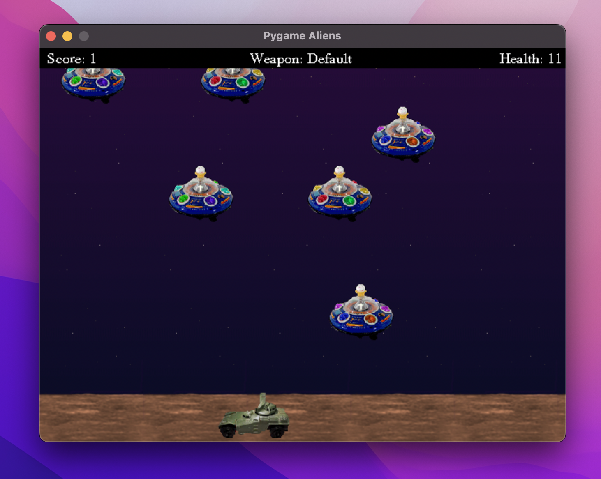
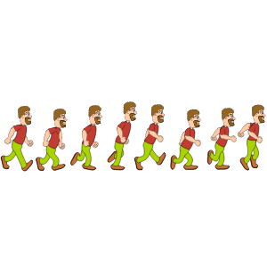
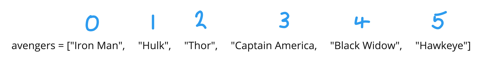
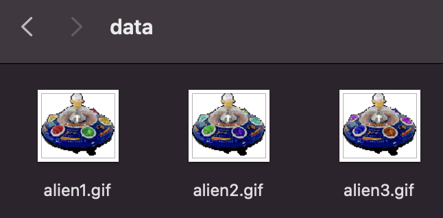

# Session 5

## Animation


---

## The Objective

Today we're going to add animations to our game.

So far, each sprite just has a single image that translates its position around the screen.
What we want to do is have images that actually change, 
like a character that walks instead of just glides around the screen, 
stuck in the same pose.



Notice in the image that some aliens are different?
We're going to animate the alien's image so that its lights flash different colours.


---

## Animation Sequences



An animation is just a sequence of images played one after the other to give the illusion of motion.




---

## Arrays

To help us make animation sequences in code, it's going to be really useful to learn about arrays.

Remember how a variable stores a single value under a label?

```python
my_variable = 572
```

Well, an array is very similar.
It just stores multiple values under a single label:

```python
my_array = [89, 4, 12, 0, 395, 4]
```


---

## Your Turn

Just like with variables, we can store different data types in an array.

Using the Python Console...
1. Create an array called `names` that stores 4 different names as strings.
2. Create an array called `prices` that stores the cost of 5 different shopping items as floats.
3. Output each array using the `print()` command to see their contents.


---

## Accessing Arrays

If you want to access the value in a variable or change its value, we could just refer to the label like so:

```python
>>> age = 12
>>> print(age)
12
>>> age = 13
>>> print(age)
13
```

To access individual items within an array, we need to use an index.
The index always starts from 0 (the first item).



So to access the third item in the array, we use:

```python
>>> avengers = ["Iron Man", "Hulk", "Thor", "Captain America", "Black Widow", "Hawkeye"]
>>> print(avengers[2])
Thor
>>> avengers[2] = "Spider-Man"
>>> print(avengers[2])
Spider-Man
```


---

## Your Turn

1. Create an array of superhero names.
2. Ask the user to input the index of the character they want to replace.
3. Convert it to an integer.
4. Ask the user to input the name of the new character they'd like to replace them with.
5. Update the array, storing the new character at the chosen index position.
6. Output the whole array to see the changes.


---

## Iterating Over Arrays

This is the last thing we'll check out before animation.
Often we need to be able to cycle through each and every item in an array.

We could access them one at a time...

```python
print(avengers[0])
print(avengers[1])
print(avengers[2])
print(avengers[3])
print(avengers[4])
print(avengers[5])
```

But as the array gets longer, this becomes really boring.


---

## Solution: FOR Loops

Instead, we can use the `len()` function to find the length of the array and a FOR loop to iterate through each item.

```python
length = len(avengers)
for i in range(0, length):
    print(avengers[i])
```

Much shorter!

### Your turn

Using the Python Console...
1. Create an array of integers.
2. Using a FOR loop, add 10 to each number in the array.
3. Finally, output the contents of the whole array to see the effect.


---

## Creating the array of images

Great! Now we can use arrays to make animations.
The first step is to load each image in our animation sequence and store them in an array.

Our `data/` folder contains three images for the aliens ('alien1.gif', 'alien2.gif' and 'alien3.gif').



Our `Alien` sprite class has an array for images called `images`.

```python
class Alien(Sprite):
    speed = 13
    images = [None, None, None]
    ...
```


---

## Your Turn

1. Search for the following code. This is where we'll load our images.

```python
# Load images, assign to sprite classes.
# (do this before the classes are used, after screen setup)
img = pygame.image.load("data/explosion1.gif")
Explosion.images = [img, pygame.transform.flip(img, 1, 1)]
```

2. Write a FOR loop that iterates from 0 to 3.

3. Inside the FOR loop, we need to determine the current filepath.
Join `"data/alien"` with `(i+1)` and `".gif"` and store the resulting string in a variable called `filepath`.

4. Use the `pygame.image.load()` function to load the image at the given `filepath`.

5. Store this image in the `Alien.images` array at position `i`.

<details>
    <summary>Stuck?</summary>

```python
for i in range(0, 3):
    filepath = "data/alien" + str(i+1) + ".gif"
    Alien.images[i] = pygame.image.load(filepath)
```
</details>


---

## Animating the Alien

Once the game starts, our code will load the three alien images and store them in the `images` array in the `Alien` sprite class.

From there, we want to change the alien's current image to cycle through those in the array during the game.

### Your Turn

1. Search for the `__init__()` initialisation function under the `Alien` sprite class.
2. Add a new variable here called `anim_index` to store 0 as the initial index.
Remember, it should start with `self.` so it can be accessed within the class. 
3. Search for the `update()` function under the `Alien` sprite class. 
The code here gets triggered every frame of the game.

4. Set the alien's `image` variable equal to the image in the `images` array at position `anim_index`.
5. Add one to the `anim_index` to move it onto the next one in the sequence.
6. Use an IF statement to check if it equals the length of the `images` array.
7. If so, reset the `anim_index` to 0.
8. Run the code and you should see the aliens' lights flashing!

<details>
    <summary>Stuck?</summary>

```python
class Alien(Sprite):
    speed = 13
    images = [None, None, None]
    image = None
    containers = None

    def __init__(self):
        Sprite.__init__(self, self.containers)
        self.image = pygame.transform.scale(self.image, (80, 71))
        self.rect = self.image.get_rect()
        self.facing = random.choice((-1, 1)) * Alien.speed
        if self.facing < 0:
            self.rect.right = SCREENRECT.right
        self.anim_index = 0

    def update(self):
        self.rect.move_ip(self.facing, 0)
        if not SCREENRECT.contains(self.rect):
            self.facing = -self.facing
            self.rect.top = self.rect.bottom + 1
            self.rect = self.rect.clamp(SCREENRECT)
        self.image = self.images[self.anim_index]
        self.anim_index = self.anim_index + 1
        if self.anim_index == len(self.images):
            self.anim_index = 0
```
</details>


---

## Challenges

Search for free 2D image sequences online and add more animations to the game.
How about...
1. More realistic explosions?
2. Animated background elements?
3. A new humanoid sprite for the player with a walk cycle?

