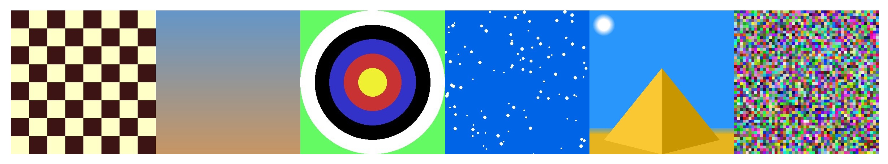

# Sketch

Sketch is a Python module you can use to draw images with code.

---

## Requirements

You will need to install Python and Pygame before using the sketch module.

### Install Python
1. Click on this link to go to the Python downloads page: https://www.python.org/downloads/
2. Press the orange button to download the latest version of Python for your operating sytem.
3. Once the file has downloaded, open it and follow the instructions. When it asks you whether you want to install `pip`, make sure to tick this box!

### Install Pygame
4. Open the `Terminal` application (Mac/Linux) or `Command Prompt` (Windows).
5. Copy and paste this command into the terminal: `python3 -m pip install -U pygame --user` and then press the `return` key on your keyboard.
6. If all has gone well, you should be able to copy and paste the following command into your terminal: `python3 -m pygame.examples.aliens`. After pressing the `return` key again, a small window should appear, allowing you to play a game of `Aliens`.

### Install the Sketch module
7. Finally, open the following page in your web browser: https://github.com/PaoloMura/ks3-project
8. Click on the green button marked `code` and then select `Download ZIP` to download the ZIP file.
9. On Mac, double-click the file. On Windows, right click the file, select `extract all` and then follow the instructions.
10. You should be able to find the sketch folder within this folder.

---

## Getting Started

Read the `cheat-sheet.md` file - it tells you how to use the `sketch` module. 

Either follow the lessons in the `worksheets` folder, or just freestyle!

