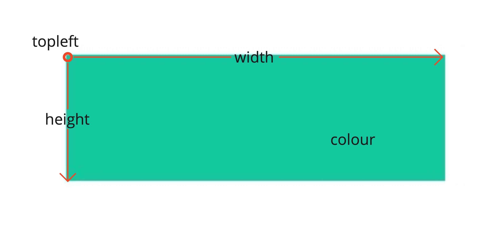
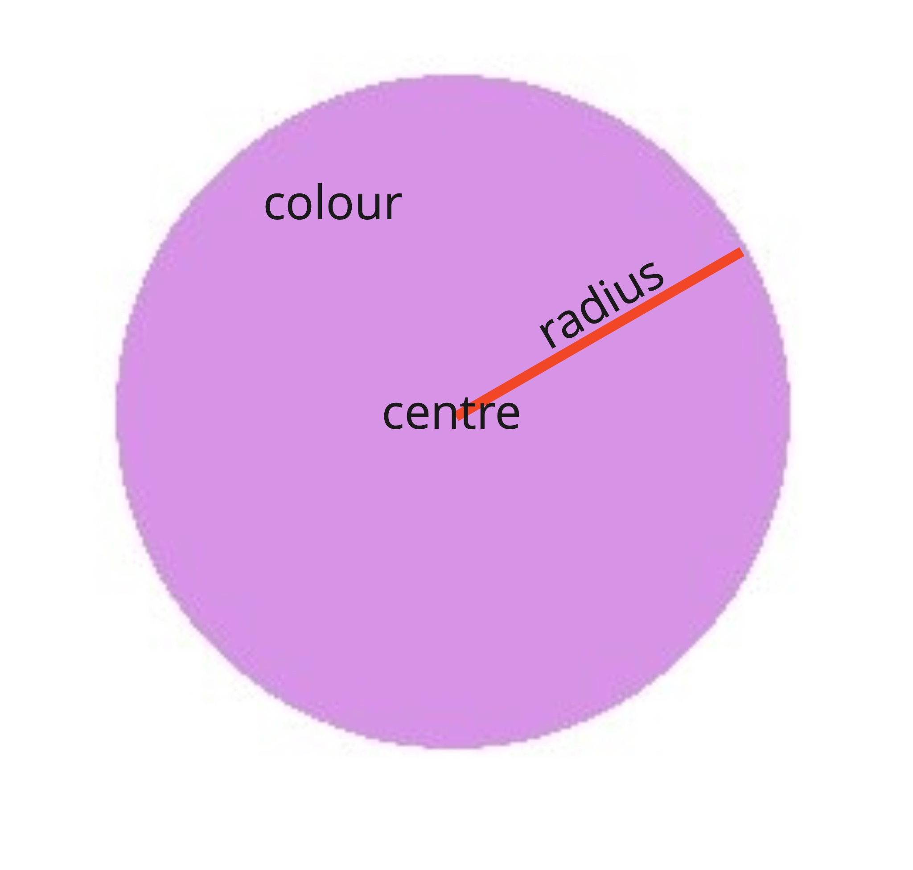
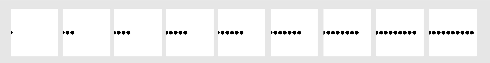

# Python Sketch

This cheat sheet is a short guide on how to use the Sketch module.
Neither this cheat sheet nor the worksheets teach Python basics.
If you need help with Python syntax, check out these resources:

* https://www.w3schools.com/python/
* https://www.tutorialspoint.com/python/


---

### Create a File

Create a new Python file and give it a name. Make sure it lives in the same folder as the `sketch.py` file.


---

### Window Setup

```python
from sketch import Window # imports code from the sketch module
win = Window(500, 500) # creates a 500x500 pixel window called 'win'
# TODO: add your code here
win.display() # displays the window
```


---

### Screenshots

To save one of your images, run the code and with the window open, press the ENTER/RETURN key on your keyboard.
Once you close the window, your screen capture will be saved in the same directory your Python file is in.


---

### Colours

A colour can be represented by RGB (red green blue) values.
0 is the minimum and 255 is the maximum. So

```python
red = [255, 0, 0]
```

means maximum red with minimum blue and green.
To easily find out the RGB values for a particular colour, use Google's [color picker](https://g.co/kgs/6nrJno).


---

### Coordinates

The screen is made up of a rectangular grid of pixels.
Each pixel is an individual colour.

The top left pixel is at coordinate (0,0).
The x-axis goes horizontally from left to right.
The y-axis goes vertically from top to bottom.


---

### Rectangles

```python
win.rectangle(<colour>, <topleft>, <width>, <height>)
```
* `<colour>` must be an RGB array, like `[255, 0, 0]`
* `<topleft>` must be an (x,y) coordinate array, like `[50, 100]`
* `<width>` must be an integer between 0 and the width of the window, like `200`
* `<height>` must be an integer between 0 and the height of the window, like `55`

Example:
```python
win.rectangle([39, 194, 116], [60, 50], 400, 80)
```




---

### Circles

```python
win.circle(<colour>, <centre>, <radius>)
```
* `<colour>` must be an RGB array, like `[0, 255, 0]`
* `<centre>` must be an (x,y) coordinate array, like `[300, 350]`
* `<radius>` must be an integer greater or equal to 1, like `45`

Example:
```python
win.circle([200, 100, 200], [250, 250], 200)
```




---

### Triangles

```python
win.triangle(<colour>, <point1>, <point2>, <point3>)
```
* `<colour>` must be an RGB array, like `[0, 0, 255]`
* `<pointN>` must be an (x,y) coordinate array, like `[300, 100]`

Example:
```python
win.triangle([200, 200, 100], [50, 250], [300, 75], [400, 400])
```


---

### Lines

```python
win.line(<colour>, <start>, <end>, <width>)
```
* `<colour>` must be an RGB array, like `[0, 0, 0]`
* `<start>` must be an (x,y) coordinate array, like `[75, 175]`
* `<end>` must be an (x,y) coordinate array, like `[125, 300]`
* `<width>` must be an integer greater or equal to 1, like `5`

Example:
```python
win.line([255, 0, 0], [50, 50], [400, 400], 10)
```


---

### Animations

An animation is a sequence of images.
Each image in an animation is known as a 'frame':



When you play through the images quickly, it gives the illusion of motion:


---

### The Animation Class

To animate your images, use the `Animation` class instead of the `Window` class.

It behaves almost identically:

```python
from sketch import Animation

# Create an animation window that is 500 pixels wide and 500 pixels tall. 
win = Animation(500, 500)

for i in range(500):
    # Draw a circle, whose x position changes each iteration of the loop.
    win.circle([0, 0, 0], [i, 250], 10)
    # Move onto the next frame of the animation.
    win.next_frame()

# Run the animation in a loop with a frame rate of 30 FPS.
win.display(framerate=30, loop=True)
```

Note the changes:

1. After drawing on each frame of the animation, you must call `win.next_frame()` to start drawing on the next frame.
2. The `win.display()` function has an additional two parameters: framerate and loop (see below).
3. Screenshots are not supported.

Framerate:
* This limits how fast the animation will play, measured in Frames Per Second (FPS). 
* The default value is 30 FPS. 
* A value of -1 will not limit the animation, allowing it to play as fast as your CPU can handle!

Loop:
* If `True`, your animation will play continuously in a loop.
* If `False`, your animation will only play once, but when done, will save it to a .GIF file in the same folder as your code.
