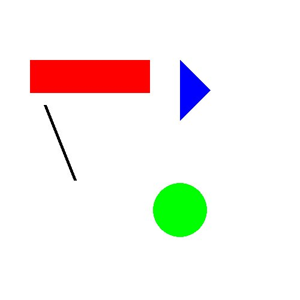
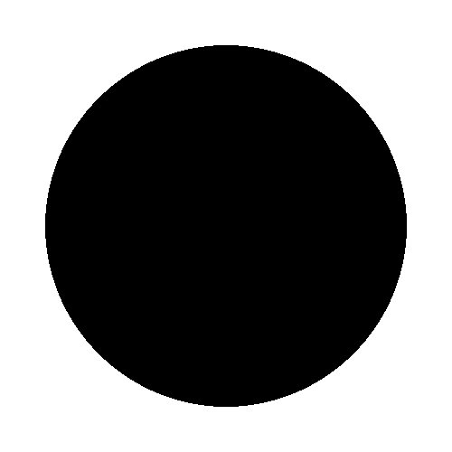
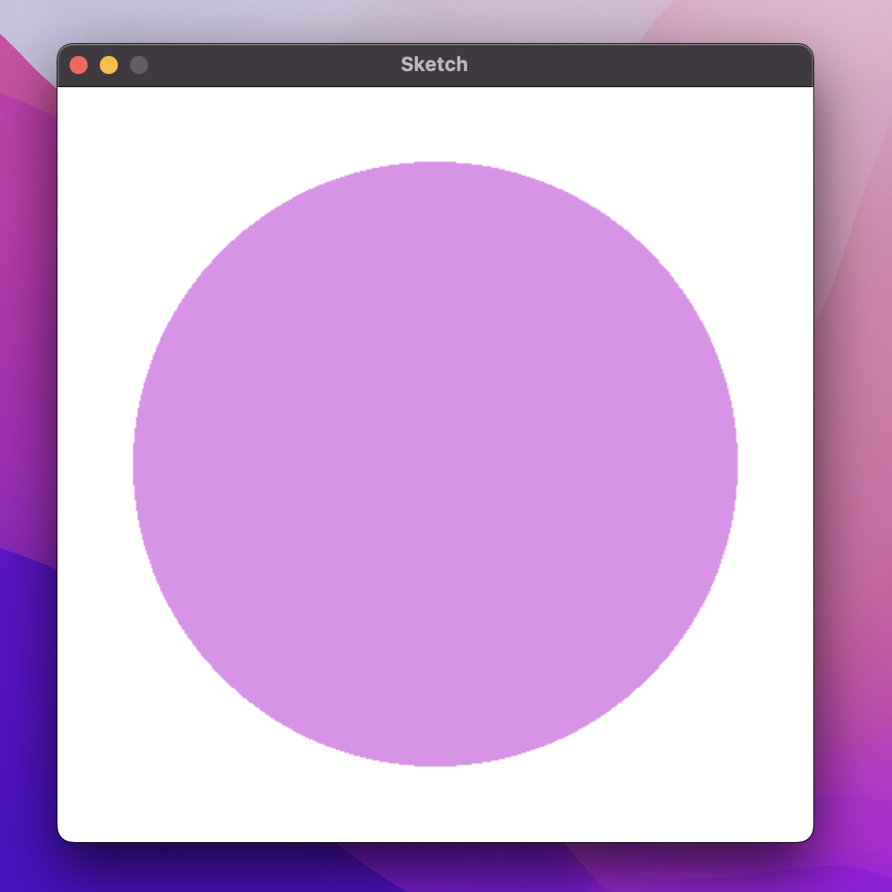
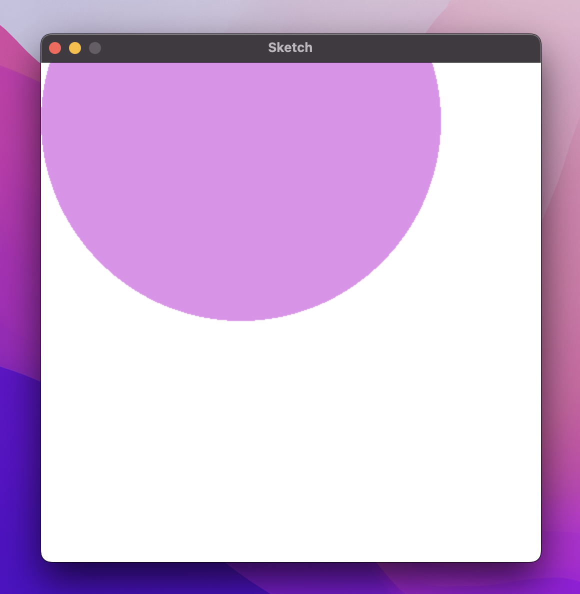
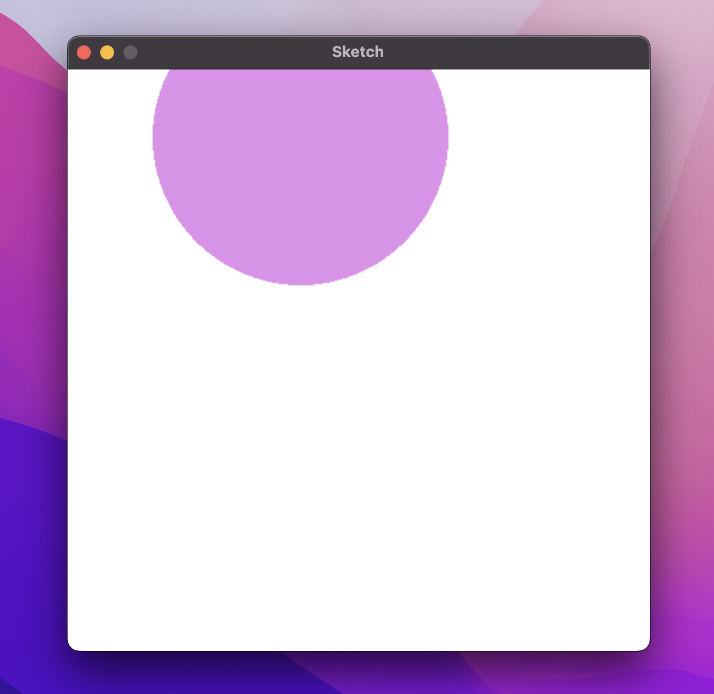

# Generating Shapes

In this worksheet, we're going to create a program that allows the user to generate shapes.

Make sure you have the cheat sheet open - it tells you everything you need to know to use the Sketch module.

<details>
    <summary>Click here if you need help with Python</summary>

The following resources may be useful for this worksheet:
* [input](https://www.w3schools.com/python/python_user_input.asp)
* [converting between data types (casting)](https://www.w3schools.com/python/python_casting.asp)
* [arrays (lists)](https://www.w3schools.com/python/python_lists.asp)
</details>




---

## Step 1: Window Setup

First, create a new Python (.py) file and give it a name.
Make sure to save it in the same folder as the sketch.py file.

Now, add each of the following lines of code to the file:

```python
from sketch import Window
```

This imports the Window class from the sketch module. 

```python
win = Window(500, 500)
```

This creates a new window that is 500 pixels wide and 500 pixels tall.
It saves it in a variable called 'win' so we can use it later.

```python
win.display()
```

Finally, when your program reaches this line of code, it will display the window you just created.

If you run the code, you should see a blank canvas, like this:


To close the window, press the red circle or the ESCAPE key.

From now on, all the code you write should go _after_ you create the window, but _before_ you display it.


---

## Step 2: Draw a Circle

Let's get straight into drawing shapes!
To draw a circle, we use the `win.circle()` command from the cheat sheet.

```python
win.circle(<colour>, <centre>, <radius>)
```

This command takes in three values: the colour of the circle, the centre and the radius.

So to draw a black circle with centre at coordinate (250, 250) and a radius of 200 pixels, write:

```python
win.circle([0, 0, 0], [250, 250], 200)
```

If you run your code, you should see the following image:




---

## Step 3: Changing the Colour

How exactly do we represent different colours?
Answer: using RGB values.

We represent colours using an array of three values.

```python
my_colour = [200, 175, 109]
```

The first value tells us how much red the colour contains.
The second is the amount of green and the third is the amount of blue.
Hence the name RGB (red, green, blue).

So the `my_colour` variable contains 200 parts red, 175 parts green and 109 parts blue.

You can use
[W3 Schools RGB calculator](https://www.w3schools.com/colors/colors_rgb.asp)
or
[Google's colour picker](https://g.co/kgs/uDJhW5)
to find out what this colour looks like, or use it as the colour value for your circle and re-run the code!

Each individual colour channel (red, green or blue) must be between 0 (the minimum) and 255 (the maximum).
Lower values give darker colours, higher values give lighter colours.

Can you work out what the RGB array for the following colours would be?
* white
* red
* green
* blue
* yellow
* magenta
* cyan


---

## Step 4: Inputting the Colour

Let's give control to the user now.
At this stage we're going to allow the user to input how much red, green and blue the colour should have.
We will then generate a circle with the corresponding colour.

1. Write code that allows the user to input the amount of red in the colour.
2. Convert it to an integer.
3. _Optional: can you add validation to ensure that the user only enters a whole number between 0 and 255?_
4. Do the same for green and blue.
5. Create an array with these three values.
6. Use this array as the colour for your circle in the `win.circle()` command.

Now if you run the code, you should hopefully see something like this:

```python
>>> Enter the amount of red: 215
>>> Enter the amount of green: 147
>>> Enter the amount of blue: 229
```

Then once you've entered some valid values, a window should appear:




---

## Step 5: Inputting the Centre

Now let's give the user the chance to input the centre position of the circle.

The centre must be an array of two values; the (x, y) coordinate of the circle's centre:

```python
centre = [x, y]
```

So add the following to your code:
1. Allow the user to input the x position of the centre.
2. Convert this to an integer.
3. _Optional: Add validation to make sure that they entered a whole number between 0 and the width of the screen._
4. Do the same for the y value (_for validation, it should be between 0 and the_ height _of the screen this time)._
5. Create an array using these two values.
6. Use this array as the centre of your circle in the `win.circle()` command.

All together, when you run your code you should now get:

```python
Enter the amount of red: 215
Enter the amount of green: 147
Enter the amount of blue: 229
Enter the x position of the centre: 200
Enter the y position of the centre: 59
```

After entering all the values, the window should appear again:



By using different values for the x and y position, can you work out where the (0, 0) coordinate is on the screen?
Which way do the axes go?

<details>
    <summary>Hint</summary>

Check out the cheat sheet!
</details>


---

## Step 6: Inputting the Radius

This is the final step before the user has all the power.
Complete the following steps to allow the user to decide on the circle's radius:

1. Allow the user to enter the radius of the circle.
2. Convert it to an integer.
3. _Optional: add validation to make sure they enter a positive, whole number._
4. Use this value as the radius of the circle in the `win.circle()` command.

Again, if you run the code you should get the option to enter all the parameters yourself:

```python
Enter the amount of red: 215
Enter the amount of green: 147
Enter the amount of blue: 229
Enter the x position of the centre: 200
Enter the y position of the centre: 59
Enter the radius: 127
```

And as always, the circle will be generated:




---

## Challenges

### Task 1:

Can you write a similar program, but this time one for generating rectangles?
Specifically, allow the user to enter the following values:
* The colour of the rectangle,
* The coordinate of the rectangle's top left corner,
* The width of the rectangle and
* The height of the rectangle.

Then, generate and display the corresponding rectangle.

### Task 2:
If you found that easy, how about letting the user choose which shape to draw?

In other words, first ask the user which shape they want to draw.
Then, use an IF statement to ask them to enter different values depending on the shape they chose.
For example, the circle requires a radius, whereas the rectangle needs a width and height.

How about the other shapes: lines and triangles? (check the cheat sheet!)

Can you spot any ways to make your code more efficient?

