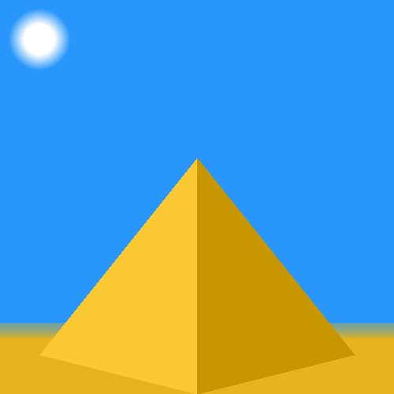
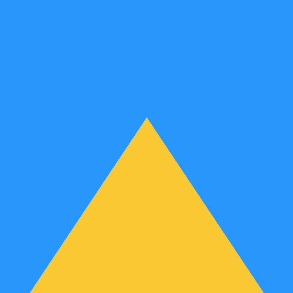

# Pyramid

In this worksheet we're going to make an image of a pyramid.

<details>
    <summary>Click here if you need help with Python</summary>

The following resources may be useful for this worksheet:
* [variables](https://www.w3schools.com/python/python_variables.asp)
* [arrays (lists)](https://www.w3schools.com/python/python_lists.asp)
* [for loops](https://www.w3schools.com/python/python_for_loops.asp)
</details>




---

## Step 1: Window Setup

First, create a new Python (.py) file and give it a name.
Make sure to save it in the same folder as the sketch.py file.

Now, add the following lines of code to the file:

```python
from sketch import Window
win = Window(500, 500)

win.display()
```

This creates and displays a window that is 500 pixels wide and 500 pixels tall.
Feel free to change the width and height to get a different sized screen.

If you run the code, you should see a blank canvas, like this:


From now on, all the code you write should go _after_ you create the window, but _before_ you display it.


---

## Step 2: Background

The next step is to draw the background. To do this, we're going to draw a rectangle that fills the entire screen.

First, create a variable to store the background colour.
Assign it an array of the three RGB colour values you want your background to be.

```python
<variable> = [<red>, <green>, <blue>]
```

Next, use the rectangle command to draw a rectangle onto the window.
* Its colour should be the variable you just defined,
* Its top-left corner should be at coordinate (0,0),
* The width and height should match those of the window.

```python
win.rectangle(<colour>, <topleft>, <width>, <height>)
```

If you run the code now, you should see something like this:


---

## Step 3: Bottom Layer

Before we make a 3-dimensional pyramid, let's have a go at creating a 2D pyramid of blocks.

Since each layer is going to be the same colour, the first step is to create a constant variable for this colour.

```python
pyramid_colour = [<red>, <green>, <blue>]
```


The following values will change for each layer, so initialise them as variables:
* The x coordinate of the top left corner,
* The y coordinate of the top left corner, and
* The width of the layer.

Next, use the `win.rectangle()` command with these variables to draw the bottom layer of the pyramid:
```python
win.rectangle(<colour>, <topleft>, <width>, <height>)
```

After running the code, you should see the start of your pyramid:


---

## Step 4: Multiple Layers

Now it's time to add the remaining layers.

Create a FOR loop that will repeat the following steps (the exact number of iterations is up to you):

1. Update the x, y and width variables.
2. Use the `win.rectangle()` command to create the next layer using these updated values.

<details>
    <summary>Hint 1</summary>

How much do you need to subtract from the y value each time?
(It should be a constant difference)
</details>

<details>
    <summary>Hint 2</summary>

How much do you need to add to the x coordinate each time?
And how much does the width decrease by?

The values in the diagram are just examples but hopefully help to visualise the answer:


</details>

<details>
    <summary>Answer</summary>

```python
pyramid_colour = [250, 200, 50]
x = 70
y = 460
width = 360
win.rectangle(pyramid_colour, [x, y], width, 40)
for i in range(5):
    y = y - 40
    x = x + 30
    width = width - 60
    win.rectangle(pyramid_colour, [x, y], width, 40)
```
</details>


---

## Step 5: Triangle

This time, let's just use the triangle command to create a perfectly smooth-sided pyramid.

```python
win.triangle(<colour>, <point1>, <point2>, <point3>)
```

You'll need to consider:
* The colour to fill the triangle with,
* The coordinates of the three points on the screen.




---

## Step 6: 3D Pyramid

This step is actually pretty straightforward.
It's simply a case of drawing two triangles that share two points along the centre of the screen.

It's up to you where exactly each of the coordinates are, as long as the middle two are the same for both triangles.

To differentiate between the triangles, you could make them slightly different colours, 
giving the illusion that one side of the pyramid is in shadow.

I also added a circle for the sun and rectangle for the ground.


---

## Challenges

### Task 1

Revisit the block pyramid.
Are you able to change the number of layers the pyramid has?

Can you use this technique to create a triangle?


### Task 2

Notice how the sun and the sand blend into the sky in the first image on this worksheet?
That's a technique introduced in the final worksheet (gradients).
Once you have checked it out, come back and give it a go!
