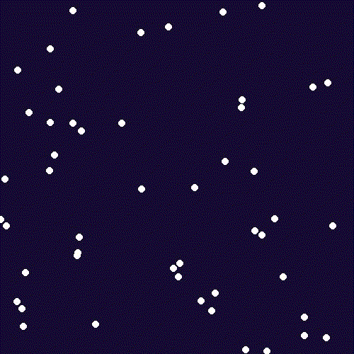
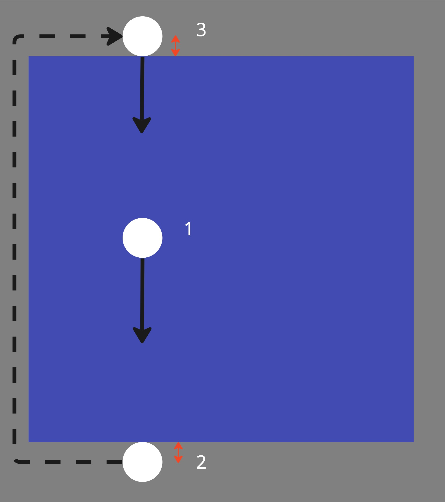
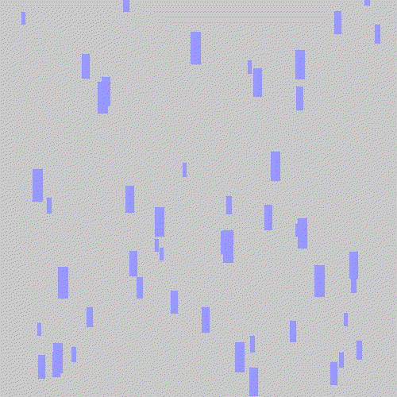

# Falling Snow

Remember when we made an image of random snowballs?
In this worksheet, we're going to animate it.


Make sure you have the cheat sheet open - it tells you everything you need to know to use the Sketch module.

If you get stuck, you can...
* Ask for help,
* Check the dropdown hints,
* Search the error in a web browser, or
* Move onto the next part of the exercise
  (there's a chance it will help reveal the answer).

<details>
    <summary>Click here if you need help with Python</summary>

The following resources may be useful for this worksheet:
* [variables](https://www.w3schools.com/python/python_variables.asp)
* [arrays (lists)](https://www.w3schools.com/python/python_lists.asp)
* [2D lists (2D arrays) might help to understand 3D arrays](https://www.tutorialspoint.com/python_data_structure/python_2darray.htm)
* [random (particularly `random.randint()`)](https://www.w3schools.com/python/module_random.asp)
* [for loops (particularly nested for loops)](https://www.w3schools.com/python/python_for_loops.asp)
</details>


---

## Step 1: Window Setup

First, create a new Python (.py) file and give it a name.
Make sure to save it in the same folder as the sketch.py file.

Now, add each of the following lines of code to the file:

```python
from sketch import Animation
```

This imports the Animation class from the sketch module.

```python
SCREEN_WIDTH = 500
SCREEN_HEIGHT = 500
win = Animation(SCREEN_WIDTH, SCREEN_HEIGHT)
```

This creates a new window that is 500 pixels wide and 500 pixels tall.
It saves it in a variable called 'win' so we can use it later.

```python
win.display()
```

Finally, when your program reaches this line of code, it will display the window you just created 
and play any animations that you've made. 

If you run the code, you should see a blank canvas, like this:


To close the window, press the red circle or the ESCAPE key.

From now on, all the code you write should go _after_ you create the window, but _before_ you display it.


---

## Step 2: Initialise the Snow

Overall, we want to generate snowballs in random positions, and then animate them moving down the screen.
This means we're going to need to keep track of every snowball's position.

Somehow, we need to store data for 50 snowballs: their x position and their y position:

| Snowball |  x    |  y    |
| :-------: | :---: | :---: |
| 0         | 8     | 200   |
| 1         | 367   | 500   |
| 2         | 327   | 399   |
| ...       | ...   | ...   |
| 49        | 61    | 467   |

A 2D array would be a very suitable data structure for this task.
Each row can be used for a different snowball.
Then the first column can be for the x value and the second column for the y value.
The index (0 to 49) can be used to refer to a particular snowball.

```python
snow_balls = [[8, 200],
              [367, 500],
              [327, 399],
              ...
              [61, 467]]
```

Rather than write out the array manually, try the following approach instead:

1. Import the `random` module at the start of your file.
2. In your main program, create an empty array called `snow_balls`.
3. Use a FOR loop to repeat the following, 50 times:
   1. Use `random.randint()` to generate a random x position (between 0 and the width of the screen) and store it in a variable called `x`.
   2. Do the same for the y position (between 0 and the height of the screen) and store it in a variable called `y`.
   3. Create a new snowball as `[x, y]`
   4. Append this snowball to the `snow_balls` array.

You can check if it's worked by printing out the contents of the `snow_balls` array at the end.

<details>
    <summary>Answer</summary>

```python
# Create an empty array.
snow_balls = []
for _ in range(50):
    # Randomly generate the x and y values.
    x = random.randint(0, SCREEN_WIDTH)
    y = random.randint(0, SCREEN_HEIGHT)
    # Append the new snowball to the list.
    snow_ball = [x, y]
    snow_balls.append(snow_ball)

# This line is just for testing purposes.
print(snow_balls)
```
</details>

---

## Step 3: Drawing the Snow

Now that we've got our data stored, we can use it to draw the snowballs.

For this part, you'll need to clear the background, 
then iterate over every snowball in the `snow_balls` array, 
creating a new circle at the given position each time.

To make the snowballs move down the screen, add 5px to the y position in the array each time, after drawing the circle.

Once you've drawn all the snowballs in the array, remember to call `win.next_frame()`, then repeat for whole process for the next frame.

Fingers crossed, if you run your code, you should end up with some falling snow:



<details>
   <summary>Hint?</summary>

1. Use a FOR loop to repeat the following for as many frames as you'd like:
   1. Create a dark blue rectangle to cover the entire screen.
   2. Use another FOR loop to go through each index `i` in the `snow_balls` array:
      1. Extract the `x` position for snowball `i` in the array.
      2. Extract the `y` position for snowball `i` in the array.
      3. Draw a white circle with centre at `[x, y]` and radius `5`.
      4. Add `5` to the `y` value in the array for snowball `i`.
   3. Use `win.next_frame()` to start drawing on the next frame.
</details>
   
<details>
   <summary>Answer</summary>

```python
 # Repeat for 100 frames.
 for _ in range(100):
     # Clear the screen.
     win.rectangle(DARK_BLUE, [0, 0], SCREEN_WIDTH, SCREEN_HEIGHT)
     # Iterate over each row i in the array.
     for i in range(len(snow_balls)):
         # Extract the x and y values from the columns of row i.
         x = snow_balls[i][0]
         y = snow_balls[i][1]
         # Draw the snowball.
         win.circle(WHITE, [x, y], 5)
         # Move the y position down the screen by 5 pixels.
         snow_balls[i][1] += 5
     # Start drawing on the next frame.
     win.next_frame()
```
</details>


---

## Step 4: Regenerating the Snow

Great! We can draw snow *and* make it move down the screen.

But it only works once...

To fix that, let's modify our code so that after we add to the y position, we check if the snowball has gone off the screen.
If it has, we should reset it, so it appears at the top again.



To do this, write an IF statement just after you update the snowball's value.
It should check if the y value is greater than the height of the screen.
If so, it should reset the y value to be less than 0.

By this point, we should have a nice loop of the snow continuously falling:


<details>
   <summary>Hint 1</summary>

If it doesn't seem to be working at all, i.e. your changes aren't having any effect, make sure that you're modifying the values in the array.

i.e.
```python
snow_balls[i][y] = -5
```

and not some local variable like
```python
y = -5
```
</details>

<details>
   <summary>Hint 2</summary>

Do your snowballs disappear too early?
Or appear out of thin air?

Think carefully about the y value.
Remember it refers to the circle's centre; if the radius is large, part of the circle could still be on the screen, even if the centre isn't.

</details>


---

## Step 5: Size Variation

To make the animation more visually appealing, we could add some variation to the size of the snowballs.

As well as storing information about each snowball's x and y values, we'll also need to store their radius.

Find the code where you first created the array.
Modify it so that it has an extra column: the radius.

You can generate the radius randomly the same as you did for the position.
Try a smaller range (e.g. 3 to 6 pixels).

| Snowball |  x    |  y    | r     |
| :-------: | :---: | :---: | :---: |
| 0         | 8     | 200   | 3     |
| 1         | 367   | 500   | 5     |
| 2         | 327   | 399   | 4     |
| ...       | ...   | ...   | ...   |
| 49        | 61    | 467   | 3     |

Once this is done, you can update your FOR loop so that it extracts the radius as well as the x and y values, then uses this value when drawing the circle.


---

## Step 6: Speed Variation

For our last trick: change the speed of different sized snowballs.

It's actually really easy - you've done all the hard work already!

We want to give the illusion that some snowballs are closer than others.
i.e. the larger (closer) ones should fall faster than the smaller (further away) ones.

You've already got access to the radius within the FOR loop from the last section.
We can just use this radius as the amount to add to the y value each time.

i.e. if the radius is 6 (large), the code will add 6 to y each time (making it fall faster).
If the radius is 3 (small), the code will add just 3 to y each time (making it fall slower).


---

## Challenges

1. Have a play around with the values for the radius, colours, etc. to see what effect it has on the look and feel of the animation.
2. At the moment, we regenerate the snowballs directly above their current position.
Can you think of a way to move them to a completely new horizontal position when regenerating?
3. Using a similar approach, what other particle animations can you create?
How about falling rain using blue lines instead of circles?
Or a fountain that spreads upwards?
Or the lightspeed effect from Star Wars?


