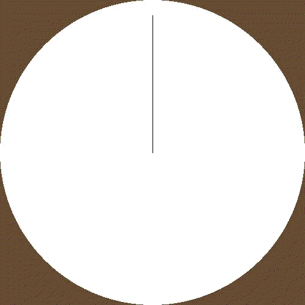
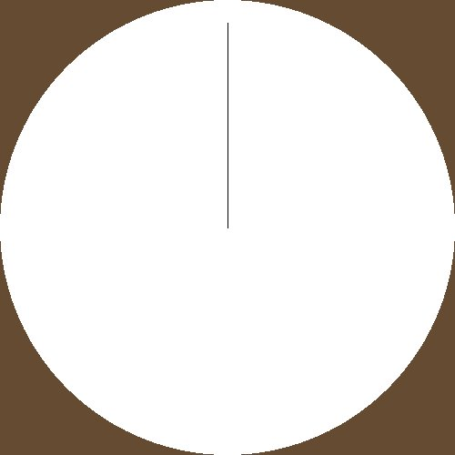
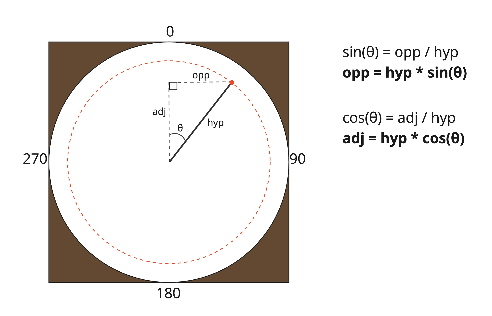
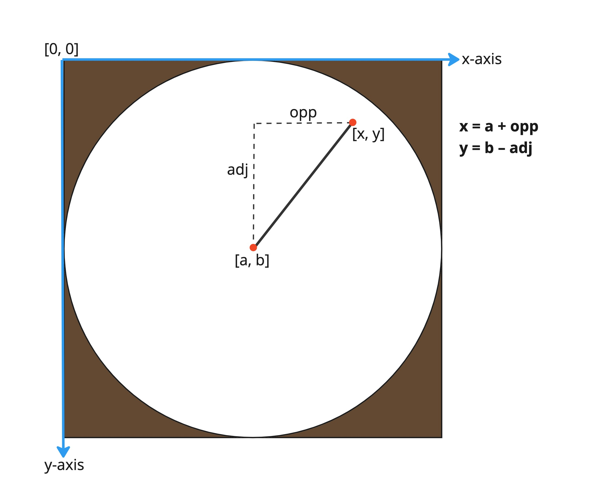

# Clock

In this worksheet, we're going to animate the hands of a clock.



Make sure you have the cheat sheet open - it tells you everything you need to know to use the Sketch module.

If you get stuck, you can...
* Ask for help,
* Check the dropdown hints,
* Search the error in a web browser, or
* Move onto the next part of the exercise
  (there's a chance it will help reveal the answer).

<details>
    <summary>Click here if you need help with Python</summary>

The following resources may be useful for this worksheet:
* [variables](https://www.w3schools.com/python/python_variables.asp)
* [arrays (lists)](https://www.w3schools.com/python/python_lists.asp)
* [math module (particularly `math.cos()`, `math.sin()` and `math.pi`)](https://www.w3schools.com/python/module_math.asp)
* [for loops](https://www.w3schools.com/python/python_for_loops.asp)
</details>


---

## Step 1: Window Setup

First, create a new Python (.py) file and give it a name.
Make sure to save it in the same folder as the sketch.py file.

Now, add each of the following lines of code to the file:

```python
from sketch import Animation
```

This imports the Animation class from the sketch module.

```python
SCREEN_WIDTH = 500
SCREEN_HEIGHT = 500
win = Animation(SCREEN_WIDTH, SCREEN_HEIGHT)
```

This creates a new window that is 500 pixels wide and 500 pixels tall.
It saves it in a variable called 'win' so we can use it later.

```python
win.display()
```

Finally, when your program reaches this line of code, it will display the window you just created 
and play any animations that you've made. 

If you run the code, you should see a blank canvas, like this:


To close the window, press the red circle or the ESCAPE key.

From now on, all the code you write should go _after_ you create the window, but _before_ you display it.


---

## Step 2: Static Clock

To start things off simply, let's only focus on the hour hand and just draw the shapes that make up the clock.

You might find it useful to define some constant variables to store the following:
* Colours (brown, black and white),
* Position of the centre of the screen,
* Length of the hour hand

The shapes we need are:
* A brown rectangle that covers the screen;
* A white circle, positioned in the centre and touching the edge of the screen; and
* A black line that starts at the centre and ends towards the edge the circle.




---

## Step 3: Finding the Coordinates (Part 1)

Since we created the hour hand as a line, to rotate it around the circle, all we need to do is change the position of its end coordinate.
But how do we get this end point to follow a circular path?

Believe it or not, trigonometry is our friend here.



As shown in the image above, the red dot represents the end point of our line.
We want it to follow the circular path demonstrated by the red dotted line.

As it follows this path, there's a right-angled triangle.
The hypotenuse is the length of the hour hand; this always stays the same length.

We're interested in finding the length of the opposite and adjacent sides.
Luckily there are two useful formulas for calculating these if we know the length of the hypotenuse and the angle θ.
(See the right-hand side of the image.)

One last thing - the angle θ must be in radians.
We can use the following formula to convert from degrees to radians:

```
angle_in_radians = angle_in_degress * π / 180
```

Can you complete the following code to find the length of the opposite and adjacent sides?
The FOR loop is used to iterate over the angles from 0° to 360°.

```python
import math

for i in range(360):
    # Convert the angle i from degrees to radians.
    angle = ...?
    
    # Calculate the length of the opposite edge.
    opp = ...?

    # Calculate the length of the adjacent edge.
    adj = ...?
```

<details>
  <summary>Hint 1</summary>

You can either type in π approximately:

```python
pi = 3.14
```

Or use the math library's inbuilt value:

```python
import math

pi = math.pi
```
</details>

<details>
  <summary>Hint 2</summary>

The math library also has an inbuilt function for `sin(x)`:

```python
import math

y = math.sin(x)
```
</details>

<details>
  <summary>Answer</summary>

`HOUR_LENGTH` is a constant that stores the length of the hour hand.

```python
import math

for i in range(360):
    angle = i * math.pi / 180
    opp = HOUR_LENGTH * math.sin(angle)
    adj = HOUR_LENGTH * math.cos(angle)
```
</details>


---

## Step 4: Finding the Coordinates (Part 2)

Now we know the length of the opposite and adjacent sides.
We also know the position of the centre of the circle (i.e. the fixed end of the hour hand line).

Using these two pieces of information, we can easily work out the position of the other end of the line:



Implement the formulas above to set x and y in your code.

<details>
  <summary>Hint?</summary>

```
FOR i = 0 TO 360
  angle = i * π / 180
  opp = HOUR_LENGTH * sin(angle)
  adj = HOUR_LENGTH * cos(angle)
  x = CENTRE[0] + opp
  y = CENTRE[1] - adj
```
</details>


---

## Step 5: Moving the Hand

Finally, it's time to see some action.

Remember the code that draws the shapes from earlier?
Let's modify it.

First, move it so that it takes place in each iteration of your FOR loop.
Then, at the end of the loop, add `win.next_frame()`:

```python
for i in range(360):
    # Code that calculates x and y goes here.
    # Code that draws a clock on the screen goes here.
    win.next_frame()
```

Now change the line drawing function so that it takes in `[x, y]` as the coordinate of its end point.

Running the code should produce something like this:


---

## Step 6: Minute Hand

Adding the minute hand is straightforward; you've already done everything you need to know for the hour hand!

The only difference is that the minute hand should be faster.
Specifically, it should complete 12 rotations for every 1 of the hour hand.

So let's do it again:

1. Define a new variable for the length of the minute hand and set it to a value that is smaller than the hour hand.
2. Copy the code for finding the angle and `[x, y]` coordinates.
3. Modify it, so you multiply the angle by 12 (since there are 12 hours on a clock face).
4. Draw another line using the new `[x, y]` values.

Now you should end up with the final result:


---

## Challenges

1. How about adding details to the clock?
There isn't currently a way to add text in the sketch module.
But maybe you could use shapes to draw the roman numerals for the hours?
(i.e. I, II, III, ..., XII)
Or if that's too much work, how about adding triangles to the ends of the lines?
2. What other interesting animations can you create with this technique of circular motion?
