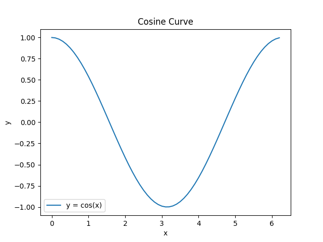
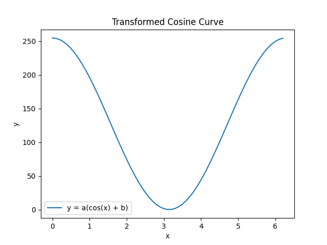
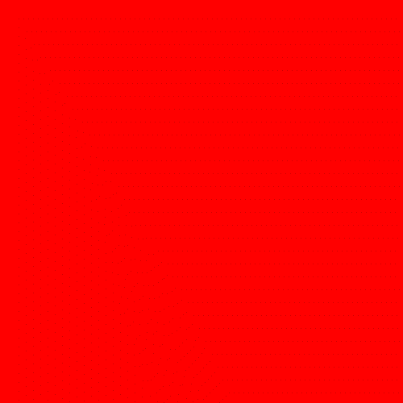
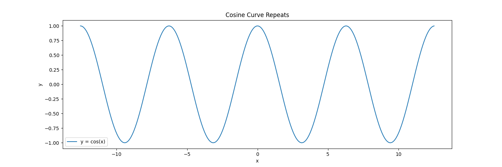
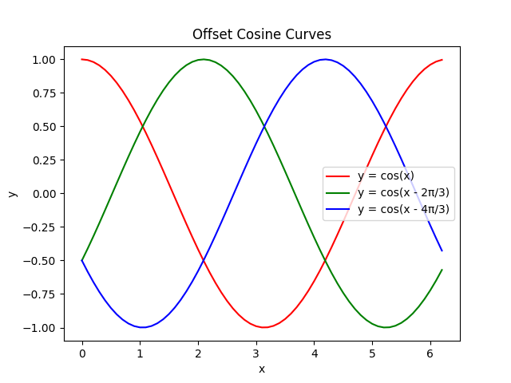
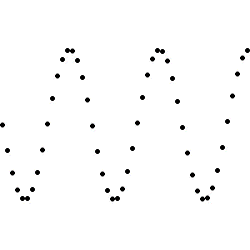

# Colour Fade

In this worksheet, we're going to create an animated transition between colours.


Make sure you have the cheat sheet open - it tells you everything you need to know to use the Sketch module.

If you get stuck, you can...
* Ask for help,
* Check the dropdown hints,
* Search the error in a web browser, or
* Move onto the next part of the exercise
  (there's a chance it will help reveal the answer).

<details>
    <summary>Click here if you need help with Python</summary>

The following resources may be useful for this worksheet:
* [variables](https://www.w3schools.com/python/python_variables.asp)
* [arrays (lists)](https://www.w3schools.com/python/python_lists.asp)
* [math module (particularly `math.cos()` and `math.pi`)](https://www.w3schools.com/python/module_math.asp)
* [for loops](https://www.w3schools.com/python/python_for_loops.asp)
</details>


---

## Step 1: Window Setup

First, create a new Python (.py) file and give it a name.
Make sure to save it in the same folder as the sketch.py file.

Now, add each of the following lines of code to the file:

```python
from sketch import Animation
```

This imports the Animation class from the sketch module.

```python
SCREEN_WIDTH = 500
SCREEN_HEIGHT = 500
win = Animation(SCREEN_WIDTH, SCREEN_HEIGHT)
```

This creates a new window that is 500 pixels wide and 500 pixels tall.
It saves it in a variable called 'win' so we can use it later.

```python
win.display()
```

Finally, when your program reaches this line of code, it will display the window you just created 
and play any animations that you've made. 

If you run the code, you should see a blank canvas, like this:


To close the window, press the red circle or the ESCAPE key.

From now on, all the code you write should go _after_ you create the window, but _before_ you display it.


---

## Step 2: A Smooth Transition

Our objective is to make an animation that smoothly transitions between colours.
To make things simpler to begin with, let's just consider black and white.

We'd like to find a way of transitioning the screen's colour so that it starts as white, then transitions to black and ends as white again (so that it loops cleanly).

Luckily, there's a mathematical function that can help:



The cosine function is perfect!
Its value starts at a maximum (+1.0), drops to a minimum (-1.0) and finally returns to the maximum (+1.0).

Can you figure out what transformations we could do to this function so that its values range from 0 to 255 instead of -1.0 to +1.0?

<details>
  <summary>Hint 1</summary>

Here's what the transformed curve looks like - can you work out what values of `a` and `b` we should use?


</details>

<details>
  <summary>Answer</summary>

First, add 1 to `cos(x)` so that the y value is between 0 and 2.

```
y = cos(x) + 1
```

Then, multiply this by 1/2 of 255 so that the y value is between 0 and 255.

```
y = 0.5 * 255 * (cos(x) + 1)
```
</details>


---

## Step 3: The Loop

Now that we've got the maths under control, let's turn it into code!

The first step is to create a loop that iterates over the x values 0° to 360°.

Then we need to convert the x value from degrees into radians using the following formula:

```
x_in_radians = x_in_degrees * π / 180
```

<details>
  <summary>Hint?</summary>

You can use the `math` library's value of π or hard code your own approximation:

```python
import math

PI = math.pi
```

or

```python
PI = 3.14159
```
</details>

<details>
  <summary>Answer</summary>

```python
import math

for i in range(360):
    x = i * math.pi / 180
```
</details>

---

## Step 4: Greyscale Colour Transition

Great!
We've got the x value, so all that's left is to generate the y value using our formula from step 2.

```
y = (cos(x) + 1) * 0.5 * 255
```

You can use the `math` library's cosine function to help.

```python
import math

y = math.cos(x) # x is a variable
```

Remember to cast the result to an integer!
(Pixel values must be whole numbers, not floats.)

Once you have the y value, you can use it to define the colour:

```python
colour = [y, y, y]
```

Finally, draw a rectangle that fills the screen, using this colour, and call the `win.next_frame()` method.

Since the three colour channels (red, green and blue) have the same y value, the colour transition will be greyscale:


<details>
  <summary>Answer</summary>

```python
# Transform the cosine curve to give a y-value between 0 and 1.
y = 0.5 * (math.cos(x) + 1)

# Map the y-value to an integer between 0 and 255.
y = int(y * 255)

# Define the colour.
colour = [y, y, y]

# Draw the rectangle to fill the screen using this colour.
win.rectangle(colour, [0, 0], SCREEN_WIDTH, SCREEN_HEIGHT)
```
</details>

---

## Step 5: A Single Colour

There's a simple modification we can make so that the transition only affects one colour channel:

```python
colour = [y, 0, 0]
```

Here we've only made the red colour channel a variable; green and blue are fixed at 0.



What happens when you set red to a constant value of 0, but use the y-value to affect a different colour channel instead?
For example:

```python
colour = [0, y, 0]
```

How about instead of setting the other channels to a fixed value of 0 (minimum), you set them to their maximum value of 255?

```python
colour = [y, 255, 255]
```

Play around with different combinations to get an understanding for what's going on.


---

## Step 6: More Colours

There's another awesome aspect of the cosine curve that we've not tapped into: it repeats... infinitely!



We can make good use of this fact to change the three colour channels independently of each other.
More specifically, we'll give each colour channel *its own* cosine curve, shifted along the x-axis.



Here we've translated the green curve along to the right by 2π/3, and we've translated the blue curve by 4π/3 to the right.
I chose these specific values so that each curve would be spread evenly apart from each other.

See if you can adapt your code to use these new formulas instead.
i.e. the colour array uses three different y-values, one for each colour channel.

```python
y_red = ...
y_green = ...
y_blue = ...

colour = [y_red, y_green, y_blue]
```

The end result is this:


<details>
  <summary>Hint?</summary>

1. Keep the same x value as before.
2. Copy the code that calculates the y value so you can calculate a separate y value for each of red, green and blue.
3. Modify these formulas so you subtract `2π/3` from the green x-value and `4π/3` from the blue y-value.
4. Update the colour array so it uses each of the three y-values.
</details>

<details>
  <summary>Answer</summary>

```python
# Calculate the x-value as before.

# Determine the y-value for red.
y_r = 0.5 * (math.cos(x) + 1)
y_r = int(y_r * 255)

# Determine the y-value for green.
y_g = 0.5 * (math.cos(x - 2 * math.pi / 3) + 1)
y_g = int(y_g * 255)

# Determine the y-value for blue.
y_b = 0.5 * (math.cos(x - 4 * math.pi / 3) + 1)
y_b = int(y_b * 255)

# Update the colour array.
colour = [y_r, y_g, y_b]
```
</details>


---

## Challenges

1. Instead of using a fixed offset between the x values of the three colour channels, can you randomly choose an offset instead?
2. This whole worksheet focused on colours specifically, but the cosine curve has nothing to do with colours!
Can you think of any other creative ways of using the cosine curve to modify attributes of shapes aside from colour?
For example, could you use it to smoothly change the position of a shape?



3. How about using other formulas such as the equations of motion from physics to animate a bouncing ball?


4. Or you could animate simulations such as [John Conway's Game of Life](https://en.wikipedia.org/wiki/Conway%27s_Game_of_Life)?


