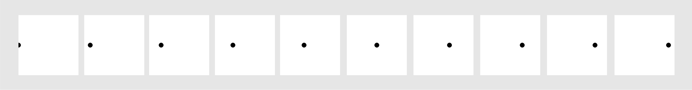

# Animations

In this worksheet, we're going to explore another exciting feature of the Sketch module: animations!


Make sure you have the cheat sheet open - it tells you everything you need to know to use the Sketch module.

If you get stuck, you can...
* Ask for help,
* Check the dropdown hints,
* Search the error in a web browser, or
* Move onto the next part of the exercise
  (there's a chance it will help reveal the answer).

<details>
    <summary>Click here if you need help with Python</summary>

The following resources may be useful for this worksheet:
* [variables](https://www.w3schools.com/python/python_variables.asp)
* [arrays (lists)](https://www.w3schools.com/python/python_lists.asp)
* [for loops (particularly nested loops)](https://www.w3schools.com/python/python_for_loops.asp)
</details>


---

## Step 1: Window Setup

First, create a new Python (.py) file and give it a name.
Make sure to save it in the same folder as the sketch.py file.

Now, add each of the following lines of code to the file:

```python
from sketch import Animation
```

This imports the Animation class from the sketch module.
It behaves almost identically to the Window class with just one or two small differences.

```python
SCREEN_WIDTH = 500
SCREEN_HEIGHT = 500
win = Animation(SCREEN_WIDTH, SCREEN_HEIGHT)
```

This creates a new window that is 500 pixels wide and 500 pixels tall.
It saves it in a variable called 'win' so we can use it later.

```python
win.display()
```

Finally, when your program reaches this line of code, it will display the window you just created 
and play any animations that you've made. 

If you run the code, you should see a blank canvas, like this:


To close the window, press the red circle or the ESCAPE key.

From now on, all the code you write should go _after_ you create the window, but _before_ you display it.


---

## Step 2: Draw a Circle

Now let's add a shape to the screen, so we can animate it.
How about...
* a black circle,
* with a radius of 20,
* positioned on the left-hand side of the screen?


<details>
    <summary>Answer</summary>

```python
from sketch import Animation

SCREEN_WIDTH = 500
SCREEN_HEIGHT = 500
win = Animation(SCREEN_WIDTH, SCREEN_HEIGHT)

black = [0, 0, 0]
centre = [0, SCREEN_HEIGHT / 2]
radius = 20

win.circle(black, centre, radius)
win.display()
```
</details>


---

## Step 3: Animation

So far, it's exactly the same as drawing shapes on the Window.
Now let's add movement to the circle.

An animation is made up of a sequence of different images (a.k.a. 'frames').
When you play through each of these frames one after the other, it gives the illusion of motion.




The Animation class has a special `next_frame()` function which allows us to start drawing onto the next frame of the animation.

```python
win = Animation(SCREEN_WIDTH, SCREEN_HEIGHT)

# draw the shapes on the first frame here
win.next_frame()

# draw the shapes on the second frame here
win.next_frame()

# draw the shapes on the third frame here
win.next_frame()

# and so on...

win.display()
```


---

## Step 4: Creating the Frames

Now it's your turn to have a go at creating the animation above.

1. First, you'll need to draw a circle at the start position `(0, 250)`.
2. Then, write `next_frame()` to start drawing on the next frame of the animation.
3. Now repeat steps 1-2, drawing another circle at the next position `(50, 250)` and so on...
4. Make sure to finish the code with `win.display()`.

If you run your code, you should hopefully see a working animation!

<details>
    <summary>Hint?</summary>


</details>

<details>
    <summary>The previous circles don't disappear?</summary>

Does your animation look something like this?
Or maybe there are just lots of circles that don't appear to animate at all?


This is because `next_frame()` doesn't create a blank window for you.
It actually makes a copy of the shapes on the previous frame.
Can you think of a way of clearing the window yourself by drawing a white rectangle on top of the screen?
</details>

<details>
    <summary>Answer</summary>

```python
from sketch import Animation

# First, create the window.
SCREEN_WIDTH = 500
SCREEN_HEIGHT = 500
win = Animation(SCREEN_WIDTH, SCREEN_HEIGHT)

# Let's define some helpful variables.
black = [0, 0, 0]
white = [255, 255, 255]
radius = 10
x = 0
y = SCREEN_HEIGHT / 2

# Use a FOR loop to repeat 10 times.
for i in range(10):
    # Cover up the screen completely with a white rectangle. 
    win.rectangle(white, [0, 0], SCREEN_WIDTH, SCREEN_HEIGHT)
    # Find the new position for the centre of the circle (the y position never changes).
    x = x + 50
    win.circle(black, [x, y], radius)
    # Move onto the next frame of the animation.
    win.next_frame()

win.display()
```
</details>


---

## Step 5: Speed

You might have noticed that your animation is really fast.
Or really slow...
There are actually a bunch of solutions for us to change the speed of the animation!

### Option 1: more or less frames

If you want to slow your animation down, add _more frames_ but only move the circle a _small amount_ each time.
This can help make your animation look smoother and more natural.

<details>
    <summary>Hint</summary>

Try repeating the loop 500 times, moving the circle just 1 pixel to the right each time.
</details>

If you want to speed up your animation, use _fewer frames_ and move the circle by a _larger amount_ each time.

<details>
    <summary>Hint</summary>

Try repeating the loop just 5 times, but move the circle 100 pixels to the right every frame.
It might get a bit crazy.
</details>

### Option 2: frame rate

The 'frame rate' tells Python how fast to play your animation.
It is measured in frames per second (FPS).

The default frame rate is 30 FPS.
A higher value will make your animation faster, and a lower value will make it play slower.

You can set the frame rate in the `win.display()` function by passing in the optional `framerate` parameter and setting its value to be something different:

```python
win.display(framerate=30)
```

### Option 3: combo

Both options are good, but a combination of the two is best.
Play around with both together to find the ideal balance between speed and smoothness.


---

## Step 6: Saving a GIF

Once you're happy with your animation, you can save it as a GIF.

To do this, simply pass in an extra `loop` parameter to your `win.display()` function:

```python
win.display(loop=False, framerate=10)
```

* When `loop` is set to `True` (the default), it will play your animation in a loop for you.
* When `loop` is set to `False`, it will only play once, but it will save a GIF file of your animation called `animation.gif`.

The GIF is likely to play slower than normal.

---

## Challenges

So you've animated a black circle moving from left to right - awesome!
How about trying out some of the following:
* A different coloured circle?
* A different shape?
* Move top to bottom?
* Move back and forth?
* Change colour/shape during the animation?
