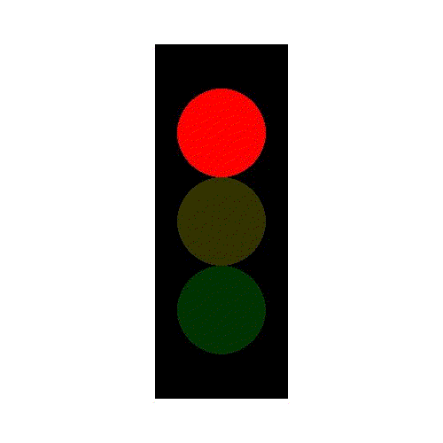
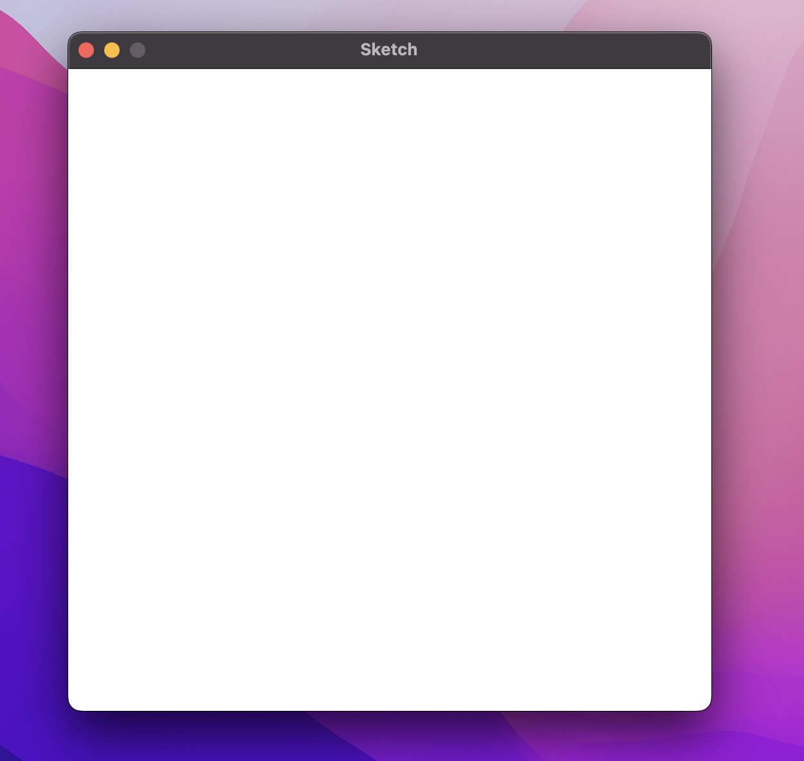
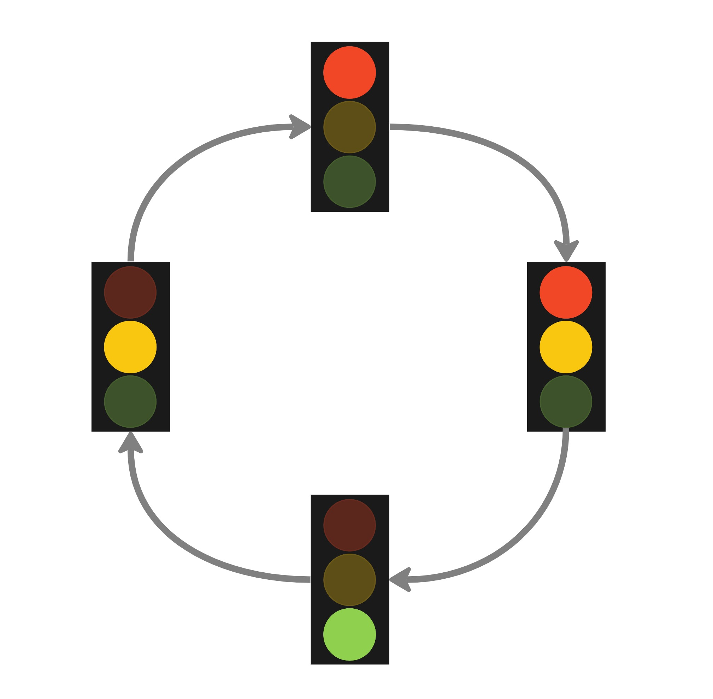
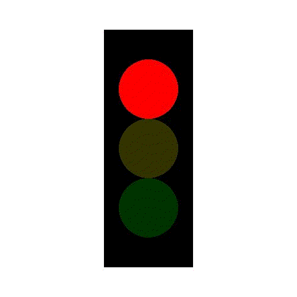

# Traffic Lights

In this worksheet, we're going to create an animation of a traffic light.



Make sure you have the cheat sheet open - it tells you everything you need to know to use the Sketch module.

If you get stuck, you can...
* Ask for help,
* Check the dropdown hints,
* Search the error in a web browser, or
* Move onto the next part of the exercise
  (there's a chance it will help reveal the answer).

<details>
    <summary>Click here if you need help with Python</summary>

The following resources may be useful for this worksheet:
* [variables](https://www.w3schools.com/python/python_variables.asp)
* [arrays (lists)](https://www.w3schools.com/python/python_lists.asp)
* [2D lists (2D arrays) might help to understand 3D arrays](https://www.tutorialspoint.com/python_data_structure/python_2darray.htm)
* [for loops (particularly nested loops)](https://www.w3schools.com/python/python_for_loops.asp)
</details>


---

## Step 1: Window Setup

First, create a new Python (.py) file and give it a name.
Make sure to save it in the same folder as the sketch.py file.

Now, add each of the following lines of code to the file:

```python
from sketch import Animation
```

This imports the Animation class from the sketch module.

```python
SCREEN_WIDTH = 500
SCREEN_HEIGHT = 500
win = Animation(SCREEN_WIDTH, SCREEN_HEIGHT)
```

This creates a new window that is 500 pixels wide and 500 pixels tall.
It saves it in a variable called 'win' so we can use it later.

```python
win.display()
```

Finally, when your program reaches this line of code, it will display the window you just created 
and play any animations that you've made. 

If you run the code, you should see a blank canvas, like this:



To close the window, press the red circle or the ESCAPE key.

From now on, all the code you write should go _after_ you create the window, but _before_ you display it.


---

## Step 2: Define the Colours

Before we draw anything, let's create variables to store all the different colours we'll be using.

Remember, we use an array of RGB values (red, green, blue) to represent colours.
255 is the maximum and 0 is the minimum that each of the three colour channels can take.
For example, bright yellow is a mix of red and green:

```python
YELLOW = [255, 255, 0]
```

I've used uppercase as a reminder for myself that this is a constant value that won't need to change.

Can you create variables for the following colours?

* black
* white
* bright red (for when the red light is on)
* dark red (for when the red light is off)
* bright amber
* dark amber
* bright green
* dark green


If you'd like to check whether these colours look the way you want, 
you could draw rectangles on the screen to test it out.
Alternatively, try out Google's [color picker](https://g.co/kgs/6nrJno).


---

## Step 3: The Light Cycle

Traffic lights in the UK go through four cycles.
Before scrolling down, do any ideas come to mind on how you could use code to iterate through this cycle?



There are probably a lot of different approaches you could take.
This is just one example:

```python
cycle = [[RED_ON, AMBER_OFF, GREEN_OFF],
         [RED_ON, AMBER_ON, GREEN_OFF],
         [RED_OFF, AMBER_OFF, GREEN_ON],
         [RED_OFF, AMBER_ON, GREEN_OFF]]
```

Here we've created a 3D array called `cycle`.

Each item in this array represents a different stage of the cycle.
For example, `[RED_ON, AMBER_OFF, GREEN_OFF]` is the first stage of the cycle.

Each value in a stage is one of the colours we defined in the previous section.
For example, `RED_ON` might be equal to `[255, 0, 0]`.

We can now use this `cycle` array to iterate over the cycle!


---

## Step 4: Iterating over the Cycle

Now for the ~~challenging~~ fun part.
We're going to iterate over the cycle using the following method:

1. Repeat the following, 4 times:
   1. Get the current stage from the `cycle` array and call it `stage`.
   2. Extract each of the colours from `stage`, storing them in variables called `red`, `amber` and `green`.*
   3. Print out what these colours are for each iteration.**

*Remember, red is the first item in the stage with index 0, amber is at index 1 and green is at index 2.

**This is just for debugging purposes, so we can check the result ourselves.
You can remove this once happy that it works as you expect.

When you run the above code, you should see something like the following in your console window.
(It will be slightly different if you've used different colour values for your lights.)

```shell
Iteration:  0
Red:  [255, 0, 0]
Amber:  [50, 50, 0]
Green:  [0, 50, 0]
Iteration:  1
Red:  [255, 0, 0]
Amber:  [255, 175, 0]
Green:  [0, 50, 0]
Iteration:  2
Red:  [50, 0, 0]
Amber:  [50, 50, 0]
Green:  [0, 255, 0]
Iteration:  3
Red:  [50, 0, 0]
Amber:  [255, 175, 0]
Green:  [0, 50, 0]
```

<details>
  <summary>Answer</summary>

```python
for i in range(4):
    stage = cycle[i]
    red = stage[0]
    amber = stage[1]
    green = stage[2]
    print('Iteration: ', i)
    print('Red: ', red)
    print('Amber: ', amber)
    print('Green: ', green)
```
</details>


---

## Step 5: Drawing the Shapes

Finally, it's time to see it come to life!

Inside the loop you created above (but after extracting the colours), do the following:

1. Draw a white rectangle to fill the screen.
2. Draw a black rectangle for the traffic light box.
3. Draw three circles on top of each other for the lights, using the colours you extracted above.
4. Move onto the next frame of the animation using `win.next_frame()`.

At this point you should be able to run the code, and you'll have a working animation!




---

## Step 6: Speed

It's very fast at the moment.
This is because there are only 4 frames in our animation; one for each stage in the cycle.
Our animation plays at 30 frames per second by default, which means it will loop through the cycle at least 7 times per second!

To slow things down, we have two options:
1. Add another loop *inside* our existing loop that just repeats the `win.next_frame()` line a bunch of times (i.e. copying the same frame multiple times).
2. Reduce the frame rate inside the `win.display(framerate=30)` function.

It's up to you which approach you prefer; the result will be the same (pretty much).


---

## Challenges

1. Can you make the lights fade colour gradually? 
For example, if the red light starts off at `[200, 0, 0]`, can you darken this colour value over a period of time until it reaches a minimum 'off' value, say `[50, 0, 0]`?
2. How about adding an extra state to the cycle?
Some traffic lights have an extra green arrow light, specifically for turning left for example.
3. Can you add another traffic light so that there are two traffic lights, each on a different side of the screen?
They should be synchronised so that when one is green, the other is red and vice versa.