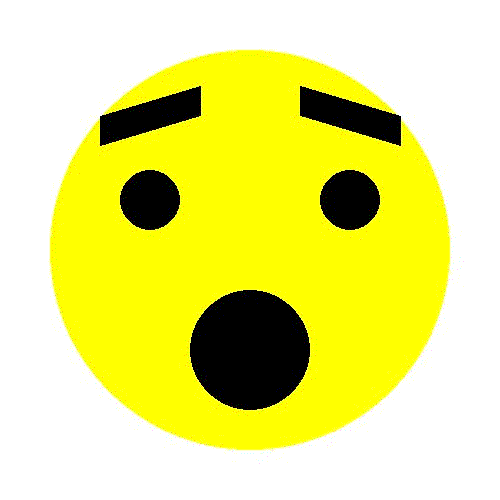
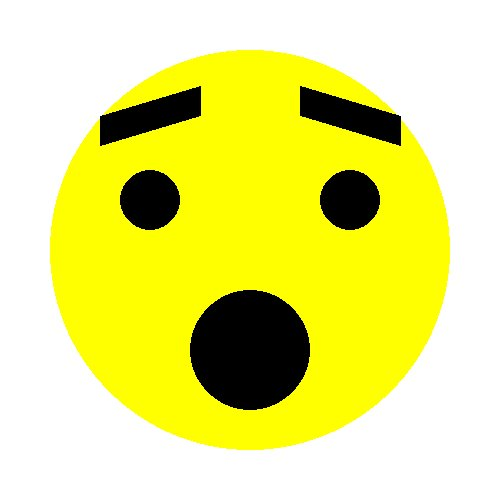
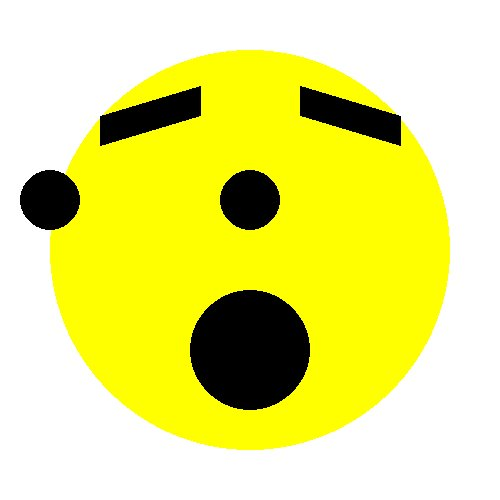
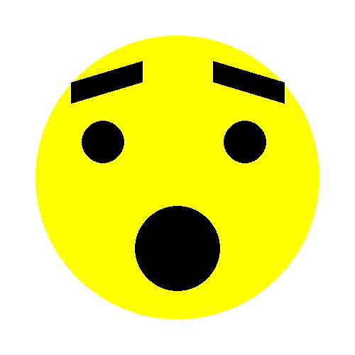
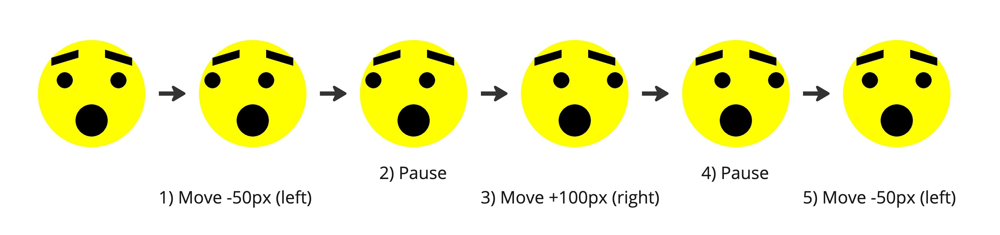

# Facial Expressions

In this worksheet, we're going to animate facial expressions.



Make sure you have the cheat sheet open - it tells you everything you need to know to use the Sketch module.

If you get stuck, you can...
* Ask for help,
* Check the dropdown hints,
* Search the error in a web browser, or
* Move onto the next part of the exercise
  (there's a chance it will help reveal the answer).

<details>
    <summary>Click here if you need help with Python</summary>

The following resources may be useful for this worksheet:
* [variables](https://www.w3schools.com/python/python_variables.asp)
* [arrays (lists)](https://www.w3schools.com/python/python_lists.asp)
* [for loops](https://www.w3schools.com/python/python_for_loops.asp)
* [functions (procedures)](https://www.w3schools.com/python/python_functions.asp)
</details>


---

## Step 1: Window Setup

First, create a new Python (.py) file and give it a name.
Make sure to save it in the same folder as the sketch.py file.

Now, add each of the following lines of code to the file:

```python
from sketch import Animation
```

This imports the Animation class from the sketch module.

```python
SCREEN_WIDTH = 500
SCREEN_HEIGHT = 500
win = Animation(SCREEN_WIDTH, SCREEN_HEIGHT)
```

This creates a new window that is 500 pixels wide and 500 pixels tall.
It saves it in a variable called 'win' so we can use it later.

```python
win.display()
```

Finally, when your program reaches this line of code, it will display the window you just created 
and play any animations that you've made. 

If you run the code, you should see a blank canvas, like this:


To close the window, press the red circle or the ESCAPE key.

From now on, all the code you write should go _after_ you create the window, but _before_ you display it.


---

## Step 2: Define a Procedure

Our objective is to animate a face so that the eyes move a little, every frame.
There might not be an obvious solution at first, but one thing's for sure: we can break the problem down.

Can you think of anything we'll need to do every single frame?

Answer:
* Fill the background
* Draw the static parts of the face
* Draw the eyes in their new position
* Move onto the next frame

The plan is to group these steps together in a subroutine (procedure).

To start off, define a new procedure called `draw_face()` with some placeholder code (e.g. output "Drawing face..."`).
Then, in your main program, call this procedure after creating the window but before displaying it.

If you run your code, the placeholder output should get printed to the console.

```shell
Drawing face...
```

<details>
    <summary>Answer</summary>

```python
def draw_face():
    print('Drawing face...')

win = Animation(SCREEN_WIDTH, SCREEN_HEIGHT)
draw_face()
win.display()
```
</details>

---

## Step 3: Drawing a Static Face

Now let's actually make this procedure draw a face.

Before we can get started, we'll have to give the procedure access to the `Animation` window (which we called `win`).
So let's pass it in as a parameter:

```python
def draw_face(win):
    print('Drawing face...')

...
draw_face(win)
...
```

Now can you replace the placeholder `print()` statement with some code that does the following?

1. Draw a white rectangle that covers the window.
2. Draw the face (background, mouth, eyebrows, eyes, etc.)
3. Move onto the next frame using `win.next_frame()`

At this point, running your code should produce something like:




---

## Step 4: Moving the Eyes

So far, we've got a procedure that draws a face.
The same face.
Every time.

If we want to be able to move the eyes, we're going to need to allow the procedure to change where it draws the eyes based on a given parameter.

First, modify the procedure header so that it now takes in an offset as an additional parameter:

```python
def draw_face(win, offset):
...
```

Next, add this offset to the x position of the eyes.

<details>
    <summary>Hint</summary>

The way you drew your eyes might be different, but here's an example that might help:
```python

# Draw the left eye.
left_eye_centre = [150 + offset, 200]
win.circle(BLACK, left_eye_centre, 30)
```

`BLACK` is a constant that is defined to store the value `[255, 255, 255]`. 
</details>

Finally, in the main program, pass in a value for the offset when calling the procedure.
For example, try `-100`:

```python
draw_face(win, -100)
```



You can change the value to try out different positions and see just how far you'd like the eyes to move in your animation.


---

## Step 5: Animating the Eyes

We're almost there; the foundations are in place.
Rather than changing the offset ourselves manually, let's automate it with a loop.

In the main program, modify your code so that it does the following:

1. Initialise a variable called `offset` and set it to `0`.
2. Create a FOR loop that repeats the following 50 times:
   1. Trigger the `draw_face()` procedure, passing in `win` and `offset` as parameters.
   2. Subtract `1` from the `offset`.

If all goes well, you should end up with something like this:



<details>
    <summary>Answer</summary>

```python
offset = 0
for _ in range(50):
    draw_face(win, offset)
    offset = offset - 1
```
</details>


---

## Step 6: More Interesting Animation

Using the method from the previous section, can you add more loops to perform each of the following actions?



It's exactly the same approach each time:
* If moving the eyes, use a FOR loop and either add or subtract a little from the offset each time.
* If pausing, draw the face, but don't update the offset!

The final result is this:


<details>
    <summary>Answer</summary>

```python
offset = 0

    # Move the eyes left.
    for _ in range(10):
        draw_face(win, offset)
        offset = offset - 5

    # Pause for 1 second (30 frames).
    for _ in range(30):
        draw_face(win, offset)

    # Move the eyes right.
    for _ in range(20):
        draw_face(win, offset)
        offset = offset + 5

    # Pause for 1 second (30 frames).
    for _ in range(30):
        draw_face(win, offset)

    # Move the eyes left again.
    for _ in range(10):
        draw_face(win, offset)
        offset = offset - 5
```
</details>


---

## Challenges

1. Instead of making the eyes move left to right, how about changing the radius so that they grow and shrink?


2. How about making them move up and down?


3. Any other expression you feel like animating?
There's so much you can do with eyes, but we've not even considered things like eyebrows or mouths!