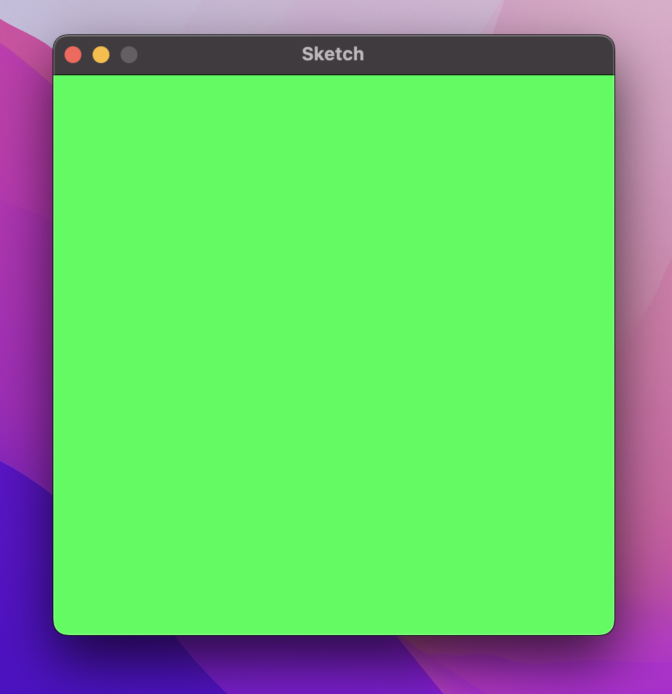
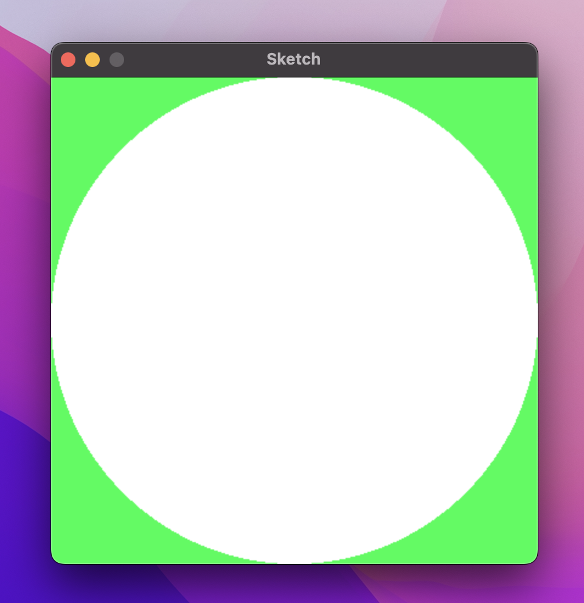
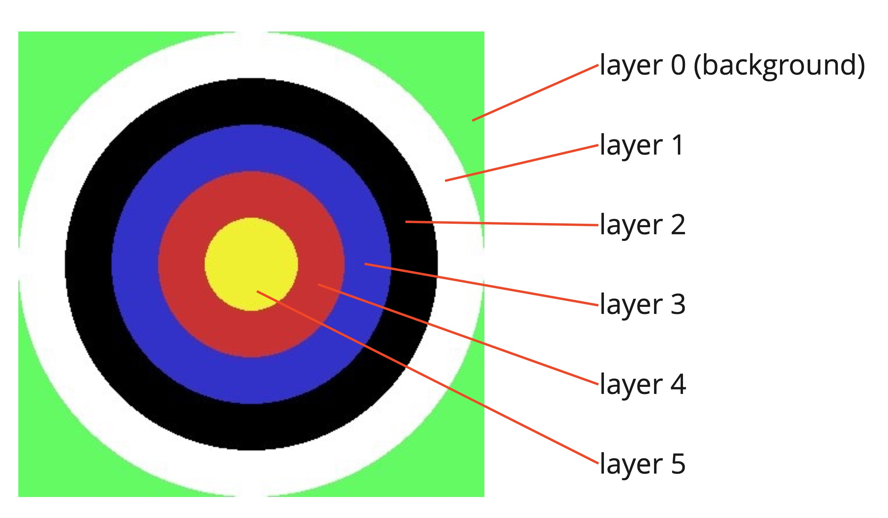
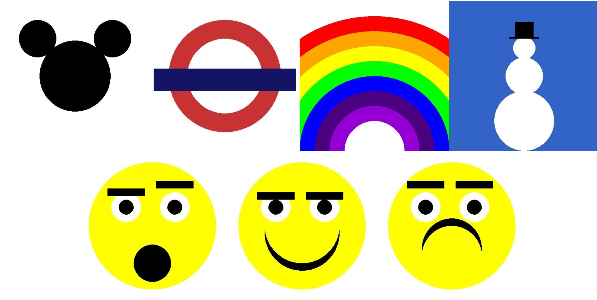

# Layering

Onions. Ogres. Cake.
In this worksheet we're going to layer shapes on top of each other to create more complex designs.

We'll start by creating this image of an archery target step by step.
Then you'll get the chance to explore other designs and create your own.


---

## Step 1: Window Setup

First, create a new Python (.py) file and give it a name.
Make sure to save it in the same folder as the sketch.py file.

Now, add the following lines of code to the file:

```python
from sketch import Window
win = Window(400, 400)

win.display()
```
This creates and displays a window that is 400 pixels wide and 400 pixels tall.
Feel free to change the width and height to get a different sized screen.

If you run the code, you should see a blank canvas, like this:


From now on, all the code you write should go _after_ you create the window, but _before_ you display it.


---

## Step 2: Background

Can you guess how we could set the background of the image?

There are probably several ways to do it, but I think the easiest is to create a rectangle that fills the screen.

Remember to check the cheat sheet if you're stuck.
Create a rectangle using the `win.rectangle()` command and the following parameters:
* A green RGB colour,
* The top left coordinate should be at position (0, 0),
* The width should match the width of the screen and
* The height should match the height of the screen.

```python
win.rectangle(<colour>, <topleft>, <width>, <height>)
```

If you've done all that correctly, you should be able to run the code and see the following window:




---

## Step 3: First Circle

After we've created the background, we can now _layer_ more shapes on top of it.

Let's create a white circle that fills the screen.

```python
win.circle(<colour>, <centre>, <radius>)
```

Can you work out what the centre and radius should be in order to generate the following image?
Think carefully about the size of the screen...

<details>
    <summary>Hint 1</summary>

If the screen is 400 pixels wide, you want the x position of the circle's centre to be halfway between 0 and 400.
</details>

<details>
    <summary>Hint 2</summary>

For the circle to fill the screen, the radius needs to be large enough to reach from the centre to the edge of the screen. 
</details>

Make sure this code goes _after_ your code for the background.
Otherwise, the circle will get drawn first, then the background on top, covering the circle up.




---

## Step 4: More Circles

To create the rest of the target, we simply layer more circles on top of each other.

For each circle:
* Use a different colour (I used white, black, blue, red and yellow),
* Use the same centre, and
* Use a smaller radius each time.

Try and get the sizes to be evenly distributed.
You could either do this through trial and error (i.e. keep trying out different values for the radii until it's close enough);
or see if you can figure out the precise values needed using maths, a ruler or any other tools that might help.

<details>
    <summary>Hint</summary>

How many circles are needed in total?

What's the width of the screen?

How much width should there be between each circle?

Can you work out what the width of the smallest circle should be?
</details>




---

## Step 5: Efficiency

_This step is quite advanced, so feel free to skip to the fun stuff in the challenges below._

There are lots of different ways to achieve the same result.

Compare your code to a friend's.
Did they solve it the same way you did?

There's usually a tradeoff between writing code that is **efficient** (i.e. uses fewer lines of code) and **readable** (i.e. easy to understand).
In my opinion, readability is often far more important, but it can be exciting to figure out clever ways of doing things too.

It's actually possible to generate the exact same target image using only 5 lines of code.

Although I don't recommend trying to do it in 5 lines (it's kind of an ugly solution), here are some tips for using fewer lines of code:

1. Store each of your colours in a 2D array.
2. Use a FOR loop to generate each circle instead of doing it one at a time.

<details>
    <summary>Hint 1</summary>

A 2D array of different greyscale colours might look something like this:
```python
colours = [[0, 0, 0],
           [50, 50, 50],
           [100, 100, 100],
           [255, 255, 255]]
```
Notice how each row is an individual colour.
To access the first colour we would use:

```python
first_colour = colours[0]
```
</details>

<details>
    <summary>Hint 2</summary>

Use a variable to store the radius of the circle.
Initialise it to the radius of the outer circle.

Write a FOR loop that iterates an index `i` from 0 to the number of rows in your 2D array of colours.
Within the FOR loop, do the following:
1. Extract the colour of this circle from the 2D array using `i` as the array index.
2. The centre of the circle will always be the same (i.e. the centre of the screen).
3. Draw the circle with the colour, centre and radius variable.
4. Calculate the radius of the next circle by subtracting an amount from the previous radius.
</details>

<details>
    <summary>Answer</summary>

```python
from sketch.sketch import Window
win = Window(400, 400)
win.rectangle([100, 250, 100], [0, 0], 400, 400)
colours = [[255, 255, 255], [0, 0, 0], [50, 50, 200], [200, 50, 50], [240, 240, 50]]
radius = 200
for i in range(5):
    win.circle(colours[i], [200, 200], radius)
    radius = radius - 40
win.display()
```
</details>


---

## Challenges

### Task 1
Check out the following images. For each one, try and work out:
* What are the shapes that make the image up?
* What is the order that they need to be drawn (i.e. the layers)?

Have a go at recreating them using code.

### Task 2

Do you have ideas for your own images?
Try and generate them using rectangles, lines, circles and triangles.



