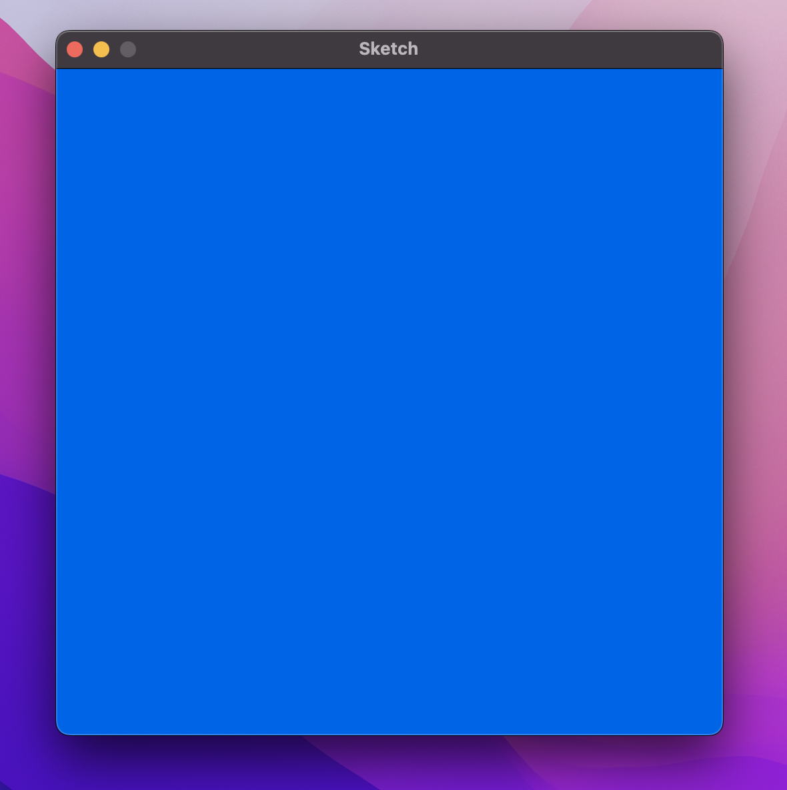

# Random

In this worksheet we're going to make an image of snow falling against a sky background.


---

## Step 1: Window Setup

First, create a new Python (.py) file and give it a name.
Make sure to save it in the same folder as the sketch.py file.

Now, add the following lines of code to the file:

```python
from sketch import Window
win = Window(500, 500)

win.display()
```

This creates and displays a window that is 500 pixels wide and 500 pixels tall.
Feel free to change the width and height to get a different sized screen.

If you run the code, you should see a blank canvas, like this:


From now on, all the code you write should go _after_ you create the window, but _before_ you display it.


---

## Step 2: Background

The next step is to draw the background. To do this, we're going to draw a rectangle that fills the entire screen.

First, create a variable to store the background colour.
Assign it an array of the three RGB colour values you want your background to be.

```python
<variable> = [<red>, <green>, <blue>]
```

Next, use the rectangle command to draw a rectangle onto the window.
* Its colour should be the variable you just defined,
* Its top-left corner should be at coordinate (0,0),
* The width and height should match those of the window.

```python
win.rectangle(<colour>, <topleft>, <width>, <height>)
```

If you run the code now, you should see something like this:




---

## Step 3: Snowball

Now let's make a snowball.
Make sure to write this code _after_ drawing the background.
Otherwise, the snowball will get drawn first, then the background on top and we won't be able to see the snowball at all!

The first step is the same as we did for the background; create a new variable for the colour of the snow and assign it an array of three RGB colour values.
Make sure each value is at its maximum so we get a white colour.

```python
<variable> = [<red>, <green>, <blue>]
```

This time, use the circle command to draw a circle on the screen.
Use the colour we just defined and a coordinate for the centre that is somewhere on the screen (i.e. both x and y should be between 0 and 500).
Play around with different sized radii until you get something you like.

```python
win.circle(<colour>, <centre>, <radius>)
```


---

## Step 4: Lots of Snowballs

Before we continue, write the following line of code at the top of your file:

```python
import random
```

This imports the random library so we can start generating random numbers.

To generate lots of snowballs, we're going to use the following algorithm:

1. Use a FOR loop to repeat the following 100 times:
2. Generate a random value between 0 and 500 and store it in a variable called x 
3. Generate another random value between 0 and 500 and store it in a variable called y
4. Use the circle command from before, but this time use [x, y] as the coordinate for the centre

All in all, this should create 100 snowballs, with each one at a random position on the screen!


---

## Step 5: Random Sizes

Finally, let's go one step further and give each snowball some variation in size.

To do this, add a line of code inside your FOR loop that generates _another_ random number and stores it in a variable called radius.
Now of course we should use this variable when running the win.circle() command.

If you run the code, you should see snowballs with different sizes:

(You might need to play around with the range of random values)


## Challenges

## Task 1

Can you change the values we set in the program to give the scene a different look and feel?
Some examples are:

* The background (Light or dark? A different colour?)
* Size of snowballs (generally small or large?)
* Size variation between snowballs (little or lots of variation?)

Can you make it so the snowballs gradually get larger further down the screen?


## Task 2

How about random noise?
The image on the left is one where every pixel is a randomly chosen colour.
The image on the right is the same, but only greyscale colours are used.

<details>
    <summary>Hint 1</summary>

Use a rectangle with width and height of 1 to set an individual pixel.
</details>

<details>
    <summary>Hint 2</summary>

Use a nested FOR loop to iterate over each pixel.
In other words, an outer FOR loop to iterate over each row `x` from 0 to the height of the screen;
and an inner FOR loop to iterate over each column `y` from 0 to the width of the screen.
</details>


