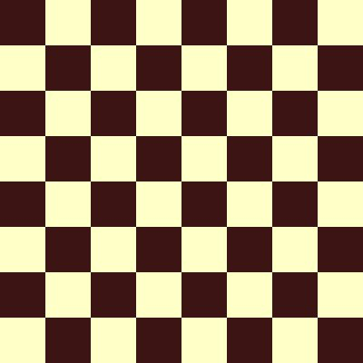
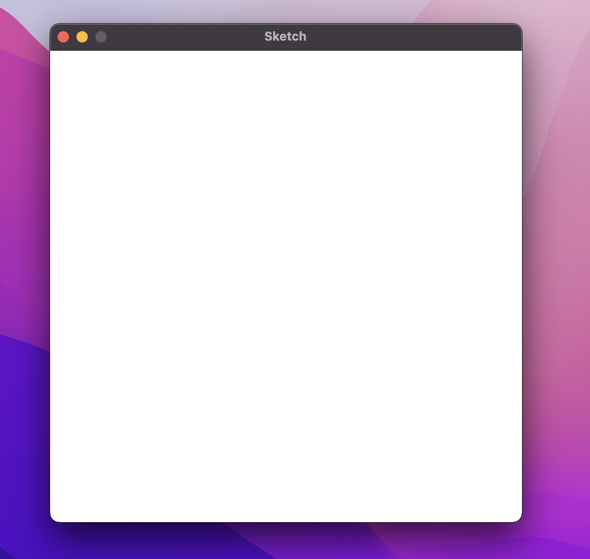
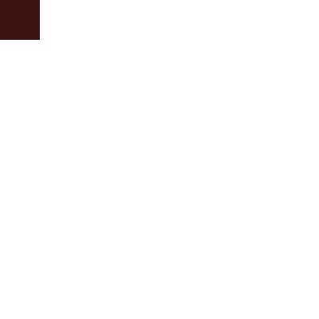
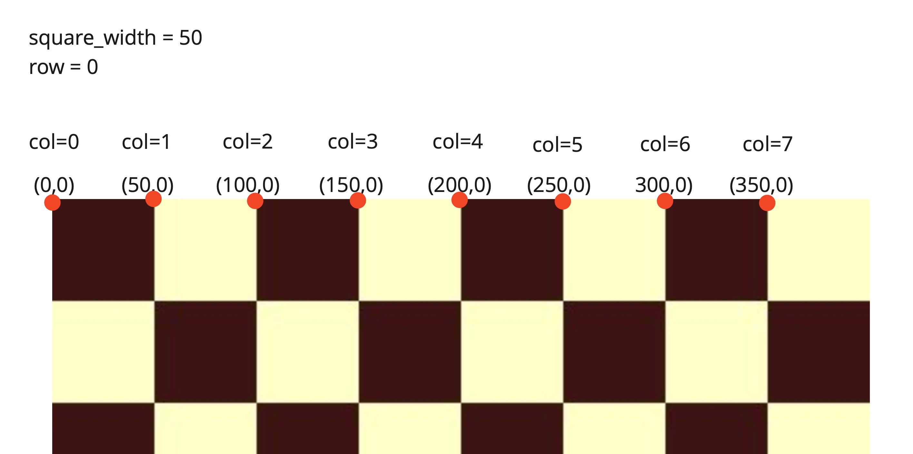
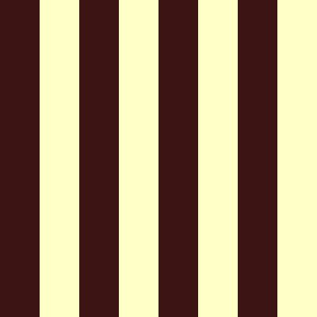
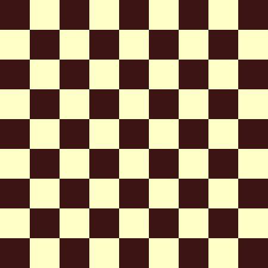
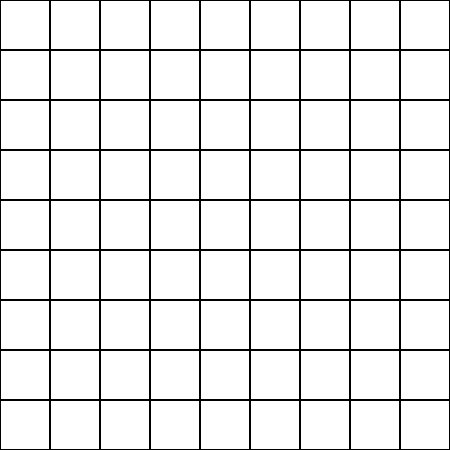

# Chessboard

In this worksheet we're going to make an image of a chessboard pattern.




---

## Step 1: Window Setup

First, create a new Python (.py) file and give it a name.
Make sure to save it in the same folder as the sketch.py file.

Now, add the following line of code to the file to import the Window class from the sketch module:

```python
from sketch import Window
```

Since a chessboard is made up of equally sized squares, let's create a variable to store the width of each square:

```python
square_width = 50
```

Can you calculate the width and height of the screen based on this value?
Check the original image if needed.

```python
win = Window(<width>, <height>)
```

Finally, we need to display the window.

```python
win.display()
```

If you run the code, you should see a square, blank canvas, like this:



From now on, all the code you write should go _after_ you create the window, but _before_ you display it.


---

## Step 2: Colours

The next step is to store the two colours that we'll need for our board.
You could use black and white or any other pair of colours you like.

Rather than storing these colours in two separate variables, can you store them both in a 2D array?
(This will be very important later.)

```python
colours = [<colour1>, <colour2>]
```


---

## Step 3: Square

Before we tackle the whole board, let's just have a go at drawing a single square on the screen.

Use the `win.rectangle()` command with the following parameters:
* One of your chosen colours,
* The top left coordinate of the screen (0, 0),
* The width of a single square as defined at the start, and
* The height, which should be the same as the width.

```python
win.rectangle(<colour>, <topleft>, <width>, <height>)
```

<details>
    <summary>Hint</summary>

To access the first value from a 2D array called colours, use:

```python
colour = colours[0]
```
</details>




---

## Step 4: Fill the Board

Let's stick to just using one colour for now.
The aim is to fill the board with squares of this colour, left to right, top to bottom.

Start off with a FOR loop that iterates over the eight rows.

```python
for row in range(0, 8):
```

Inside this FOR loop, add another FOR loop, this time iterating over the eight columns.

```python
for col in range(0, 8):
```

Now we need to calculate the x and y coordinates of the top left corner of each square.

Using `row`, `col` and `square_width`, can you find the values of the `x` and `y` coordinates?

<details>
    <summary>Hint</summary>

Here are the coordinates for the first row - can you spot the pattern?


</details>

<details>
    <summary>Answer</summary>

```python
x = col * square_width
y = row * square_width
```
</details>

At this point, you should be able to use the `win.rectangle()` command to create a square within the FOR loops, just like you did before, but this time with the x and y coordinates you just calculated.

On running the code, you should see your whole board filled with squares of this colour:


---

## Step 5: Alternating Columns

Finally, we want to alternate between the two colours for each square.
This sounds like a bit of a challenge, but there's actually a neat solution:

We could find the remainder after dividing the column by two.

| col | calculation | remainder |
| --- | ----------- | --------- |
| 0   | 0 / 2       | 0         |
| 1   | 1 / 2       | 1         |
| 2   | 2 / 2       | 0         |
| 3   | 3 / 2       | 1         |
| 4   | 4 / 2       | 0         |
| 5   | 5 / 2       | 1         |
| 6   | 6 / 2       | 0         |
| 7   | 7 / 2       | 1         |

Notice how the remainder alternates between 0 and 1?
This is perfect for choosing a different colour from our 2D array!

1. Within the FOR loop, use modulo division (`%`) to find the remainder after dividing the column by 2.
2. Now, use this value as the index to choose the colour from the 2D colours array.
3. This is the colour you should use in the `win.rectangle()` command.

If you run the code, each column's square should alternate in colour:



<details>
    <summary>Answer</summary>

```python
index = col % 2
colour = colours[index]
win.rectangle(colour, ...)
```
</details>

---

## Step 6: Alternating Squares

One more sneaky trick, and we'll have our final result.

It turns out that if we add the row and column together and _then_ divide by 2,
we'll get an index that is offset by 1 each time the row changes.

See how the remainder alternates for the first column of each row now?

| row | col | previous calculation | previous remainder | new calculation | new remainder |
| --- | --- | -------------------- | ------------------ | ----------- | --------- |
| 0   | 0   | 0 / 2                | 0                  | (0 + 0) / 2 | 0         |
| 1   | 0   | 0 / 2                | 0                  | (1 + 0) / 2 | 1         |
| 2   | 0   | 0 / 2                | 0                  | (2 + 0) / 2 | 0         |
| 3   | 0   | 0 / 2                | 0                  | (3 + 0) / 2 | 1         |
| 4   | 0   | 0 / 2                | 0                  | (4 + 0) / 2 | 0         |
| 5   | 0   | 0 / 2                | 0                  | (5 + 0) / 2 | 1         |
| 6   | 0   | 0 / 2                | 0                  | (6 + 0) / 2 | 0         |
| 7   | 0   | 0 / 2                | 0                  | (7 + 0) / 2 | 1         |

Implement this change, so that you add the row and column values together before finding the remainder.

With just this small change, re-running the code should give the final result:


---

## Challenges

With the following tasks you can modify your chessboard code to create a grid instead.

### Task 1

Can you change the size of the board?
For example, a Sudoku grid is 9x9 instead of 8x8.



### Task 2

1. First, fill the background in black. 
2. Now instead of alternating colours, use the same colour for each square (white). 
3. Add 1 to the x and y coordinates each time.
4. Subtract 2 from the width and height of the rectangle.

The last two steps make the squares slightly smaller, so they're not packed together like before.
This makes gaps between the squares, showing the black background beneath them.


