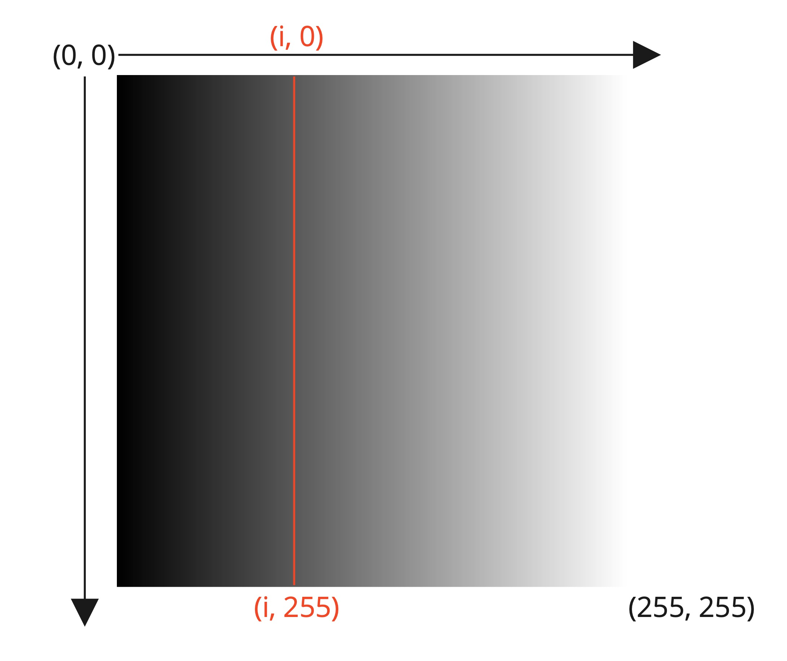
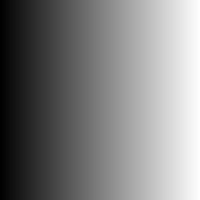
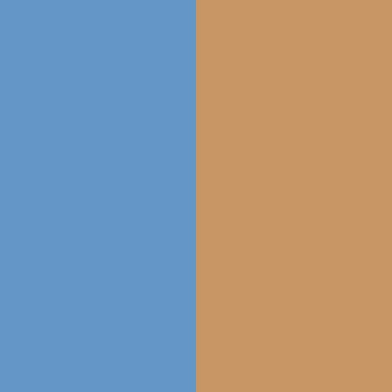
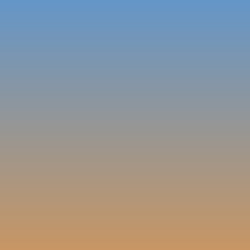
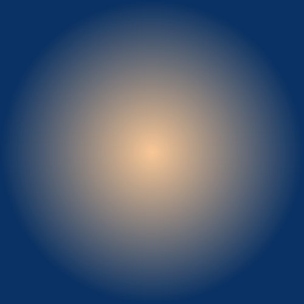

# Colour Gradient

In this worksheet we're going to make a colour gradient.
This is where an image transitions from one colour to another.


---

## Step 1: Window Setup

First, create a new Python (.py) file and give it a name.
Make sure to save it in the same folder as the sketch.py file.

Now, add the following lines of code to the file:

```python
from sketch import Window
win = Window(256, 256)

win.display()
```

This creates and displays a window that is 256 pixels wide and 256 pixels tall.
Feel free to change the width and height to get a different sized screen.

If you run the code, you should see a blank canvas, like this:


From now on, all the code you write should go _after_ you create the window, but _before_ you display it.


---

## Step 2: Black and White Gradient

Notice how we set the width and height of the window to be 256 pixels each?
This is because there are 256 possible values for each RGB colour (0 to 255).

The plan is to draw vertical lines across the screen.
The first line will be black (0, 0, 0).
The second line will be a very dark grey (1, 1, 1).
This continues all the way up to white (255, 255, 255), by which time we will have reached the width of the screen.



Let's put this into action:

1. Create a FOR loop that iterates an index `i` from 0 to 255 inclusive (i.e. one iteration for each vertical line).
2. Inside the FOR loop, create an array containing the RGB colour value (i, i, i).
3. Finally use the line command to draw a line with the colour you just created, starting from position (i, 0) and ending at (i, 255) with a width of 1 pixel.

```python
win.line(<colour>, <start>, <end>, <width>)
```

If you run your code, you should hopefully see a black-to-white colour gradient!




---

## Step 3: New Window

If you're up for a challenge, we're now going to transition from one colour to another.

To begin with, simply create a blank window with a set width and height.

```python
from Sketch import Window
WIDTH = 500
HEIGHT = 500
win = Window(WIDTH, HEIGHT)

win.display()
```

This time, I've created some constant variables to store the width and height of the screen.
This is because we're going to need to use them later as well.


---

## Step 4: Initialising the Colours

Before we start the loop this time, there are a few variables we need to create.

First, create two arrays; one for the start colour and one for the end colour.
Choose any two colours you like.

Next, create three variables; one for each colour (red, green and blue).
Initialise them to their starting colours.
For example, red would be:

```python
red = start_colour[0]
```

Where `start_colour` is the name of the array containing your first colour.

If you like, you could test your code at this point by drawing two rectangles onto the screen (one for each colour) and checking if you're happy with your choices:




---

## Step 5: The Colour Increments

Unlike before, the window is not 256 pixels wide.
Also, the individual colour channels (red, green and blue) may not be the same.
This makes it a little more challenging to work out what the colour for each line should be.

To help us out, let's determine the increment we're going to need to add to each individual colour channel.
We can calculate it as follows:

```
(end colour - start colour) / width of the screen
```

<details>
    <summary>Hint</summary>

With red as an example:
```python
red_increment = (end_colour[0] - start_colour[0]) / WIDTH
```
</details>

<details>
    <summary>Answer</summary>

By now your variables should look something like this:
```python
start_colour = [100, 150, 200]
end_colour = [200, 150, 100]

red = start_colour[0]
green = start_colour[1]
blue = start_colour[2]

red_increment = (end_colour[0] - start_colour[0]) / WIDTH
green_increment = (end_colour[1] - start_colour[1]) / WIDTH
blue_increment = (end_colour[2] - start_colour[2]) / WIDTH
```
</details>

---

## Step 6: Drawing the Lines

Now for the main event: drawing lines across the width of the screen.
The approach is very similar to the black-to-white gradient:

Write a FOR loop that iterates from 0 to the WIDTH of the screen. Inside the loop, do the following:

1. Create an array for the current colour, using the values of our colour channel variables (red, green and blue).
2. Draw a vertical line using this colour, starting from position (i, 0) to (i, HEIGHT - 1) with a width of 1 pixel.
3. Add the corresponding colour increment to each colour channel variable.

```
colour channel = colour channel + channel increment
```

<details>
    <summary>Hint</summary>

For step 3, using red as an example:
```python
red = red + red_increment
```
</details>

Hopefully if you run your code you should see the final result:


<details>
    <summary>Answer</summary>

Your FOR loop should look something like this:
```python
for i in range(0, 500):
    colour = [red, green, blue]
    win.line(colour, [i, 0], [i, HEIGHT - 1], 1)
    red = red + red_increment
    green = green + green_increment
    blue = blue + blue_increment
```
</details>


---

## Challenges

Can you change the code, so it creates a vertical gradient instead?



How about a radial gradient? i.e. a circle that fades from one colour to another?



<details>
    <summary>Hint</summary>

Layer circles on top of each other.
Each one should have a radius that is 1 pixel shorter than the previous one and a new colour (which you should work out similar to a normal colour gradient).
Maybe start off with a simple white-to-black radial gradient first?
</details>

